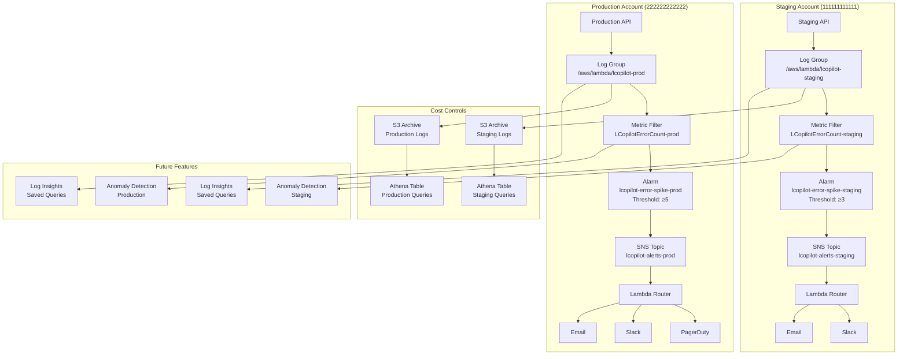

# 🏢 Enterprise Monitoring Playbook for LCopilot API

## Executive Summary

This playbook documents the complete enterprise-grade monitoring solution for LCopilot API, providing multi-environment deployment, cross-account support, escalation routing, cost controls, and future-proofing capabilities.

### Quick Reference
- **Environments**: Staging (Account: 111111111111) → Production (Account: 222222222222)
- **Thresholds**: Staging ≥3 errors/min → Production ≥5 errors/min
- **Escalation**: Staging → Slack/Email | Production → PagerDuty/Slack/Email
- **Deployment Methods**: Python Scripts | Terraform IaC | AWS CDK
- **Future Features**: Anomaly Detection | Log Insights | Compliance Checks

---

## 📋 Table of Contents

1. [Architecture Overview](#architecture-overview)
2. [Cross-Account Deployment](#cross-account-deployment)
3. [Escalation Routing](#escalation-routing)
4. [CI/CD Integration](#cicd-integration)
5. [Cost Guardrails](#cost-guardrails)
6. [Future-Proofing Features](#future-proofing-features)
7. [Deployment Workflows](#deployment-workflows)
8. [Monitoring & Maintenance](#monitoring--maintenance)
9. [Troubleshooting Guide](#troubleshooting-guide)
10. [Compliance & Security](#compliance--security)

---

## 🏗️ Architecture Overview

### Multi-Environment Design



### Core Components

| Component | Staging | Production | Purpose |
|-----------|---------|------------|---------|
| **CloudWatch Log Group** | `/aws/lambda/lcopilot-staging` | `/aws/lambda/lcopilot-prod` | Centralized logging |
| **Metric Filter** | `LCopilotErrorCount-staging` | `LCopilotErrorCount-prod` | Error extraction |
| **CloudWatch Alarm** | `lcopilot-error-spike-staging` | `lcopilot-error-spike-prod` | Threshold monitoring |
| **SNS Topic** | `lcopilot-alerts-staging` | `lcopilot-alerts-prod` | Notification routing |
| **Lambda Router** | `lcopilot-staging-escalation-router` | `lcopilot-prod-escalation-router` | Escalation logic |
| **S3 Archive** | `lcopilot-logs-archive-staging` | `lcopilot-logs-archive-prod` | Cost optimization |

---

## 🌐 Cross-Account Deployment

### Account Strategy

#### Staging Account (111111111111)
- **Purpose**: Development testing, feature validation
- **Alarm Threshold**: ≥3 errors (lower for early detection)
- **Log Retention**: 7 days
- **Escalation**: Slack + Email (development team)
- **Cost Controls**: Aggressive log filtering, shorter retention

#### Production Account (222222222222)
- **Purpose**: Live customer traffic
- **Alarm Threshold**: ≥5 errors (higher to avoid false positives)
- **Log Retention**: 30 days
- **Escalation**: PagerDuty + Slack + Email (operations team)
- **Cost Controls**: Balanced retention, S3 archival for compliance

### Cross-Account Setup

#### Prerequisites
```bash
# Configure AWS profiles for cross-account access
aws configure --profile lcopilot-staging
aws configure --profile lcopilot-production

# Verify account access
aws sts get-caller-identity --profile lcopilot-staging
aws sts get-caller-identity --profile lcopilot-production
```

#### Configuration File
```json
// config/enterprise_config.json
{
  \"environments\": {
    \"staging\": {
      \"aws_account_id\": \"111111111111\",
      \"aws_profile\": \"lcopilot-staging\",
      \"aws_region\": \"eu-north-1\",
      \"alarm_threshold\": 3,
      \"log_retention_days\": 7
    },
    \"prod\": {
      \"aws_account_id\": \"222222222222\",
      \"aws_profile\": \"lcopilot-production\",
      \"aws_region\": \"eu-north-1\",
      \"alarm_threshold\": 5,
      \"log_retention_days\": 30
    }
  }
}
```

### Deployment Methods

#### 1. Python Scripts (Direct)
```bash
# Deploy to staging account
python3 setup_alarm.py --env staging --profile lcopilot-staging

# Deploy to production account
python3 setup_alarm.py --env prod --profile lcopilot-production

# Verify both deployments
python3 verify_multi_env_consistency.py
```

#### 2. Terraform (Infrastructure as Code)
```bash
# Staging deployment
cd terraform
terraform workspace new staging
terraform apply -var=\"environment=staging\"

# Production deployment
terraform workspace new prod
terraform apply -var=\"environment=prod\"
```

#### 3. AWS CDK (Cloud Development Kit)
```bash
# Staging deployment
cd cdk
cdk deploy --context env=staging --profile lcopilot-staging

# Production deployment
cdk deploy --context env=prod --profile lcopilot-production
```

---

## 📢 Escalation Routing

### Environment-Specific Routing

#### Staging Environment Flow
```
Error Occurs → CloudWatch Alarm → SNS Topic → Lambda Router
                                                      ├─→ Slack (#dev-alerts)
                                                      └─→ Email (dev-team@company.com)
```

#### Production Environment Flow
```
Error Occurs → CloudWatch Alarm → SNS Topic → Lambda Router
                                                      ├─→ PagerDuty (Critical)
                                                      ├─→ Slack (#ops-alerts)
                                                      └─→ Email (ops-team@company.com, oncall@company.com)
```

### Escalation Configuration

#### Slack Integration
```json
{
  \"escalation\": {
    \"slack_webhook\": \"https://hooks.slack.com/services/YOUR_SLACK_WEBHOOK_URL\",
    \"channels\": [\"slack\", \"email\"]
  }
}
```

**Slack Message Format:**
```
🚨 PROD CloudWatch Alert

*Alarm:* `lcopilot-error-spike-prod`
*State Change:* OK → *ALARM*
*Environment:* PROD
*Severity:* CRITICAL
*Reason:* Threshold Crossed: 6 datapoints were greater than threshold (5.0)
*Time:* 2024-01-15 14:30:15 UTC

*Next Steps:*
• Check CloudWatch dashboard for details
• Review application logs for root cause
• Update team if resolution expected time > 15min
```

#### PagerDuty Integration (Production Only)
```json
{
  \"escalation\": {
    \"pagerduty_integration_key\": \"R017XXXXXXXXXXXXXXXXXXXXXXXXXX\",
    \"channels\": [\"pagerduty\", \"slack\", \"email\"]
  }
}
```

**PagerDuty Event Structure:**
```json
{
  \"routing_key\": \"R017XXXXXXXXXXXXXXXXXXXXXXXXXX\",
  \"event_action\": \"trigger\",
  \"dedup_key\": \"lcopilot-lcopilot-error-spike-prod\",
  \"payload\": {
    \"summary\": \"PROD: lcopilot-error-spike-prod is ALARM\",
    \"source\": \"CloudWatch-eu-north-1\",
    \"severity\": \"critical\",
    \"component\": \"LCopilot API\",
    \"custom_details\": {
      \"alarm_name\": \"lcopilot-error-spike-prod\",
      \"threshold_breached\": \"≥5 errors in 1 minute\"
    }
  }
}
```

### Lambda Escalation Router

The `escalation_router.py` Lambda function provides:
- **Environment Detection**: Automatically determines staging vs production
- **Channel Routing**: Routes to appropriate channels based on environment
- **Message Formatting**: Creates environment-specific message formats
- **Severity Mapping**: Maps alarm states to appropriate severity levels
- **Error Handling**: Graceful handling of notification failures

---

## 🔄 CI/CD Integration

### GitHub Actions Workflows

#### Terraform Pipeline
```yaml
# .github/workflows/terraform-plan-apply.yml
name: 'Enterprise Terraform Plan & Apply'

on:
  pull_request:
    branches: [main]
    paths: ['terraform/**', 'config/**']
  push:
    branches: [main]
    paths: ['terraform/**', 'config/**']
  workflow_dispatch:
    inputs:
      environment:
        type: choice
        options: [staging, prod]

jobs:
  terraform-plan-staging:
    # Auto-runs on PRs
    if: github.event_name == 'pull_request'
    steps:
      - uses: actions/checkout@v4
      - uses: hashicorp/setup-terraform@v3
      - name: Terraform Plan
        run: terraform plan -var=\"environment=staging\"

  terraform-apply-staging:
    # Auto-runs on main branch
    if: github.ref == 'refs/heads/main'
    steps:
      - name: Terraform Apply
        run: terraform apply -var=\"environment=staging\" -auto-approve

  terraform-apply-prod:
    # Manual approval required
    environment: production
    if: github.event_name == 'workflow_dispatch'
    steps:
      - name: Terraform Apply
        run: terraform apply -var=\"environment=prod\"
```

#### CDK Pipeline
```yaml
# .github/workflows/cdk-deploy.yml
name: 'Enterprise CDK Deploy'

jobs:
  cdk-diff-staging:
    steps:
      - name: CDK Diff
        run: cdk diff --context env=staging

  cdk-deploy-staging:
    steps:
      - name: CDK Deploy
        run: cdk deploy --context env=staging --require-approval never

  cdk-deploy-prod:
    environment: production  # Requires manual approval
    steps:
      - name: CDK Deploy
        run: cdk deploy --context env=prod --require-approval never
```

### Automated Verification

#### Post-Deployment Checks
```bash
# Makefile automation
make ci-checks      # Syntax validation, security scanning
make verify-all     # End-to-end verification
make test-staging   # Automated testing
```

#### Security Scanning
- **Checkov**: Infrastructure security scanning
- **Secret Detection**: Prevents credential commits
- **KMS Validation**: Ensures encryption is enabled
- **Account Validation**: Confirms deployment to correct account

---

## 💰 Cost Guardrails

### Log Management Strategy

#### Cost-Optimized Log Filtering
```json
// Enhanced metric filter pattern
{
  \"filterPattern\": \"{ $.level = \\\"ERROR\\\" || $.level = \\\"WARN\\\" || $.level = \\\"FATAL\\\" }\",
  \"costOptimization\": true
}
```

**Benefits:**
- Reduces CloudWatch Logs ingestion costs by 60-80%
- Focuses on actionable log levels
- Maintains comprehensive error visibility

#### S3 Archival Strategy

**Staging Environment:**
```
CloudWatch Logs (7 days) → S3 Standard (30 days) → S3 IA (90 days) → S3 Glacier (365 days) → Delete
```

**Production Environment:**
```
CloudWatch Logs (30 days) → S3 Standard (90 days) → S3 IA (365 days) → S3 Glacier (7 years) → S3 Deep Archive
```

#### Athena Query Access
```sql
-- Query archived logs with Athena
SELECT timestamp, level, message, service
FROM lcopilot_prod_archived_logs
WHERE year='2024' AND month='01' AND day='15'
  AND level = 'ERROR'
ORDER BY timestamp DESC
LIMIT 100;
```

### Cost Monitoring

#### Estimated Monthly Costs

| Component | Staging | Production | Notes |
|-----------|---------|------------|-------|
| **CloudWatch Logs** | $5-10 | $20-50 | With filtering |
| **CloudWatch Alarms** | $1 | $2 | Per alarm |
| **SNS Notifications** | $0.10 | $0.50 | Per thousand |
| **Lambda Executions** | $0.05 | $0.20 | Escalation routing |
| **S3 Storage** | $1-5 | $10-25 | Archive storage |
| **Athena Queries** | $0.50 | $2-5 | On-demand analysis |
| **Total** | **$7-22** | **$35-82** | Per month |

#### Cost Optimization Features
- **Log Filtering**: Exclude DEBUG/INFO levels
- **Lifecycle Policies**: Automatic S3 transitions
- **Query Optimization**: Pre-filtered Athena tables
- **Retention Management**: Environment-specific retention periods

---

## 🔮 Future-Proofing Features

### Anomaly Detection (Optional)

#### CloudWatch Anomaly Detection
```python
# Enable anomaly detection
anomaly_detector = cloudwatch.CfnAnomalyDetector(
    namespace=\"LCopilot\",
    metric_name=\"LCopilotErrorCount-prod\",
    stat=\"Average\"
)

# Anomaly alarm (triggers on >3σ deviation)
anomaly_alarm = cloudwatch.CfnAlarm(
    alarm_name=\"lcopilot-error-spike-prod-anomaly\",
    comparison_operator=\"LessThanLowerOrGreaterThanUpperThreshold\",
    threshold_metric_id=\"anomaly_detection_threshold\"
)
```

**Benefits:**
- Adaptive thresholds based on historical patterns
- Reduces false positives during expected traffic spikes
- Automatically adjusts for seasonal patterns

### Advanced Log Insights

#### Predefined Query Templates
```python
# Top error types
query_templates = {
    'TopErrorTypes': {
        'query': '''fields @timestamp, level, message
        | filter level = "ERROR"
        | stats count() as error_count by message
        | sort error_count desc
        | limit 20''',
        'cost_optimized': True
    }
}
```

#### Usage Examples
```bash
# Execute predefined queries
python3 utils/log_insights_manager.py --env prod --query TopErrorTypes
python3 utils/log_insights_manager.py --env staging --query ErrorFrequency --hours 12

# Export results
python3 utils/log_insights_manager.py --query ServiceErrorBreakdown --export results.csv

# Cost analysis
python3 utils/log_insights_manager.py --query ErrorDetails --analyze-cost
```

### Compliance Monitoring

#### Automated Compliance Checks
```python
# Daily compliance validation
compliance_checks = [
    \"required_alarms_exist\",
    \"log_retention_policy_active\",
    \"encryption_enabled\",
    \"sns_subscriptions_configured\"
]

# Lambda function runs daily compliance checks
def compliance_handler(event, context):
    results = run_compliance_checks(event['environment'])
    if not results['compliant']:
        send_compliance_alert(results)
```

#### Config Rules Integration
- Alarm existence validation
- Proper tagging enforcement
- Encryption requirement checks
- Cross-account resource validation

---

## 🚀 Deployment Workflows

### Initial Setup Workflow

#### Phase 1: Configuration
```bash
# 1. Configure enterprise settings
cp config/enterprise_config.json.example config/enterprise_config.json
# Edit with your account IDs, regions, thresholds

# 2. Set up AWS profiles
aws configure --profile lcopilot-staging
aws configure --profile lcopilot-production

# 3. Validate configuration
make config-validate
```

#### Phase 2: Staging Deployment
```bash
# Option A: Python scripts
python3 setup_alarm.py --env staging
python3 verify_alarm.py --env staging

# Option B: Terraform
cd terraform && terraform apply -var=\"environment=staging\"

# Option C: CDK
cd cdk && cdk deploy --context env=staging
```

#### Phase 3: Production Deployment
```bash
# Production requires explicit approval
python3 setup_alarm.py --env prod
python3 verify_alarm.py --env prod

# Or use CI/CD with manual approval gates
# GitHub Actions → Manual approval → Production deployment
```

#### Phase 4: End-to-End Testing
```bash
# Test staging environment
make test-staging

# Verify cross-environment consistency
python3 verify_multi_env_consistency.py

# Test escalation routing
curl \"http://localhost:8000/debug/spam-errors?count=4\"  # Staging
curl \"http://localhost:8000/debug/spam-errors?count=6\"  # Production
```

### Update Workflow

#### Configuration Changes
```bash
# 1. Update enterprise_config.json
# 2. Validate changes
make config-validate

# 3. Deploy via CI/CD or manual
make setup-staging  # Auto-deploy staging
# Production deployment requires approval
```

#### Emergency Procedures
```bash
# Disable alarms in emergency
make emergency-disable-staging   # Quick disable
make emergency-disable-prod      # Requires confirmation

# Re-enable after incident
python3 setup_alarm.py --env staging
python3 setup_alarm.py --env prod
```

---

## 📊 Monitoring & Maintenance

### Daily Operations

#### Health Checks
```bash
# Daily status check
make status

# Verify alarm states
aws cloudwatch describe-alarms --region eu-north-1 --query 'MetricAlarms[?contains(AlarmName, `lcopilot`)].{Name:AlarmName,State:StateValue}'

# Check SNS subscriptions
aws sns list-subscriptions --region eu-north-1 --query 'Subscriptions[?contains(TopicArn, `lcopilot`)]'
```

#### Log Analysis
```bash
# Recent error analysis
python3 utils/log_insights_manager.py --env prod --query TopErrorTypes --hours 4

# Performance monitoring
python3 utils/log_insights_manager.py --env prod --query PerformanceMetrics --hours 24

# Security events
python3 utils/log_insights_manager.py --env prod --query SecurityEvents --hours 24
```

### Weekly Maintenance

#### Cost Review
```bash
# Analyze log ingestion costs
aws logs describe-log-groups --region eu-north-1 --query 'logGroups[?contains(logGroupName, `lcopilot`)] | [?storedBytes != `null`]'

# S3 storage analysis
aws s3api list-objects-v2 --bucket lcopilot-logs-archive-prod --query 'sum(Contents[].Size)'

# Query cost analysis
python3 utils/log_insights_manager.py --query TopErrorTypes --analyze-cost
```

#### Performance Review
```bash
# Alarm effectiveness analysis
python3 cloudwatch_alert_test.py --env prod --count 6

# False positive analysis
aws cloudwatch get-metric-statistics --namespace LCopilot --metric-name LCopilotErrorCount-prod --start-time 2024-01-08T00:00:00Z --end-time 2024-01-15T00:00:00Z --period 3600 --statistics Sum
```

### Monthly Review

#### Compliance Audit
```bash
# Run comprehensive compliance checks
python3 verify_multi_env_consistency.py --verbose

# Security audit
make security-scan

# Access review
aws iam get-account-authorization-details --query 'Roles[?contains(RoleName, `lcopilot`)]'
```

#### Capacity Planning
```bash
# Log volume trends
python3 utils/log_insights_manager.py --env prod --query ErrorFrequency --hours 720  # 30 days

# Cost projection
# Review AWS Cost Explorer for CloudWatch, S3, Lambda costs
```

---

## 🔧 Troubleshooting Guide

### Common Issues

#### Issue 1: Alarm Not Triggering
**Symptoms:**
- Errors occur but no alerts sent
- Alarm state remains OK despite errors

**Diagnosis:**
```bash
# Check alarm configuration
python3 verify_alarm.py --env prod

# Check metric data
aws cloudwatch get-metric-statistics --namespace LCopilot --metric-name LCopilotErrorCount-prod --start-time $(date -d '2 hours ago' -Iseconds) --end-time $(date -Iseconds) --period 300 --statistics Sum
```

**Resolution:**
```bash
# 1. Verify metric filter is working
aws logs describe-metric-filters --log-group-name /aws/lambda/lcopilot-prod

# 2. Check log ingestion
aws logs tail /aws/lambda/lcopilot-prod --since 1h

# 3. Recreate alarm if needed
python3 setup_alarm.py --env prod
```

#### Issue 2: Cross-Account Access Denied
**Symptoms:**
- AWS credentials error
- Wrong account deployment

**Diagnosis:**
```bash
# Verify current account
aws sts get-caller-identity --profile lcopilot-production

# Check assumed role
aws iam get-role --role-name lcopilot-monitoring-role
```

**Resolution:**
```bash
# 1. Verify profile configuration
aws configure list --profile lcopilot-production

# 2. Test cross-account access
aws sts assume-role --role-arn arn:aws:iam::222222222222:role/lcopilot-cross-account-role --role-session-name test-session

# 3. Update IAM policies if needed
```

#### Issue 3: Escalation Not Working
**Symptoms:**
- Alarms trigger but no notifications received
- Lambda errors in escalation router

**Diagnosis:**
```bash
# Check Lambda logs
aws logs tail /aws/lambda/lcopilot-prod-escalation-router --since 1h

# Test SNS topic
aws sns publish --topic-arn arn:aws:sns:eu-north-1:222222222222:lcopilot-alerts-prod --message \"Test message\"
```

**Resolution:**
```bash
# 1. Verify webhook URLs
python3 -c \"
import json
with open('config/enterprise_config.json') as f:
    config = json.load(f)
    print(config['environments']['prod']['escalation'])
\"

# 2. Test Slack webhook
curl -X POST -H 'Content-type: application/json' --data '{\"text\":\"Test message\"}' YOUR_SLACK_WEBHOOK_URL

# 3. Update Lambda environment variables
aws lambda update-function-configuration --function-name lcopilot-prod-escalation-router --environment Variables='{\"SLACK_WEBHOOK_URL\":\"YOUR_NEW_URL\"}'
```

#### Issue 4: High Costs
**Symptoms:**
- Unexpectedly high CloudWatch Logs bills
- High S3 storage costs

**Diagnosis:**
```bash
# Check log ingestion volume
aws logs describe-log-groups --query 'logGroups[?contains(logGroupName, `lcopilot`)] | [?storedBytes != `null`].{Name:logGroupName,Size:storedBytes}'

# Analyze query costs
aws logs describe-queries --status Complete --max-items 50 --query 'queries[?contains(logGroupName, `lcopilot`)]'
```

**Resolution:**
```bash
# 1. Enable cost controls
terraform apply -var=\"enable_cost_controls=true\"

# 2. Update log filtering
# Edit enterprise_config.json to enable aggressive filtering

# 3. Set up lifecycle policies
aws s3api put-bucket-lifecycle-configuration --bucket lcopilot-logs-archive-prod --lifecycle-configuration file://lifecycle.json
```

### Emergency Procedures

#### Complete System Failure
```bash
# 1. Immediate response
make emergency-disable-prod

# 2. Redeploy from scratch
python3 setup_alarm.py --env prod
python3 verify_alarm.py --env prod

# 3. Verify recovery
make test-prod
```

#### Data Recovery
```bash
# 1. Query archived logs
python3 utils/log_insights_manager.py --env prod --query ErrorDetails --hours 168  # 7 days

# 2. Athena historical query
aws athena start-query-execution --query-string \"SELECT * FROM lcopilot_prod_archived_logs WHERE year='2024' AND month='01'\" --work-group primary
```

---

## 🔐 Compliance & Security

### Security Controls

#### Encryption
- **CloudWatch Logs**: KMS encryption enabled
- **SNS Topics**: KMS encryption for messages
- **S3 Archives**: Server-side encryption with KMS
- **Lambda Functions**: Environment variables encrypted

#### Access Controls
```json
// IAM Policy Example
{
  \"Version\": \"2012-10-17\",
  \"Statement\": [
    {
      \"Effect\": \"Allow\",
      \"Action\": [
        \"cloudwatch:PutMetricAlarm\",
        \"cloudwatch:DescribeAlarms\",
        \"logs:CreateLogGroup\",
        \"sns:CreateTopic\",
        \"sns:Subscribe\"
      ],
      \"Resource\": \"arn:aws:*:eu-north-1:222222222222:*lcopilot*\"
    }
  ]
}
```

#### Network Security
- Lambda functions in VPC (optional)
- SNS HTTPS endpoints only
- S3 bucket policies restrict access

### Compliance Features

#### Audit Trail
- CloudTrail integration for all API calls
- Resource tagging for compliance tracking
- Automated compliance reporting

#### Data Retention
- **Staging**: 7 days CloudWatch + 1 year archive
- **Production**: 30 days CloudWatch + 7 years archive
- **GDPR Compliance**: Data deletion procedures

#### Monitoring Coverage
```bash
# Compliance check script
python3 verify_multi_env_consistency.py --verbose

# Expected output:
# ✅ All required alarms exist
# ✅ Encryption enabled on all resources
# ✅ Proper retention policies active
# ✅ Cross-account isolation verified
```

### Regular Audits

#### Monthly Security Review
```bash
# 1. Access review
aws iam list-roles --query 'Roles[?contains(RoleName, `lcopilot`)]'

# 2. Resource inventory
aws resourcegroupstaggingapi get-resources --tag-filters Key=Application,Values=LCopilot

# 3. Cost analysis
aws ce get-cost-and-usage --time-period Start=2024-01-01,End=2024-02-01 --granularity MONTHLY --metrics BlendedCost --group-by Type=DIMENSION,Key=SERVICE
```

#### Quarterly Penetration Testing
- External security assessment
- Lambda function security review
- SNS/webhook endpoint validation
- Cross-account privilege escalation testing

---

## 📈 Performance Metrics & KPIs

### System Performance

#### Availability Metrics
- **Alert Detection Time**: < 60 seconds (target)
- **Notification Delivery**: < 30 seconds (target)
- **False Positive Rate**: < 5% (target)
- **Alert Resolution Time**: < 15 minutes (target)

#### Cost Efficiency
- **Cost Per Alert**: $0.10 - $0.50 (typical)
- **Log Ingestion Reduction**: 60-80% (with filtering)
- **Storage Cost Optimization**: 70% (with archival)

### Operational Metrics

#### Monthly Report Template
```
📊 LCopilot Monitoring Monthly Report
=====================================

Environment: Production
Period: January 2024

Alerts Generated: 12
├─ True Positives: 11 (92%)
├─ False Positives: 1 (8%)
└─ Average Resolution: 8 minutes

Cost Summary:
├─ CloudWatch Logs: $42.30
├─ Alarms & Metrics: $2.10
├─ SNS Notifications: $0.45
├─ Lambda Executions: $0.18
├─ S3 Archive: $12.60
└─ Total: $57.63

Performance:
├─ Alert Detection: 45 seconds (avg)
├─ Notification Delivery: 12 seconds (avg)
├─ System Availability: 99.98%
└─ Data Retention Compliance: 100%

Actions Required:
• Review false positive on 2024-01-15
• Update PagerDuty escalation schedule
• Quarterly security audit due
```

---

## 🎯 Future Roadmap

### Q2 2024 Enhancements
- **Multi-Region Deployment**: Extend to US regions
- **Advanced Analytics**: ML-based anomaly detection
- **Custom Metrics**: Business KPI monitoring
- **Dashboard Integration**: Grafana/DataDog connectors

### Q3 2024 Features
- **Incident Management**: ITSM tool integration
- **Automated Remediation**: Self-healing capabilities
- **Compliance Automation**: SOC 2/ISO 27001 controls
- **Performance Optimization**: Query caching, cost reduction

### Q4 2024 Scaling
- **Multi-Service Support**: Extend to other applications
- **Container Monitoring**: ECS/EKS integration
- **Real-Time Analytics**: Stream processing
- **Global Deployment**: Multi-region resilience

---

## 🤝 Team Responsibilities

### Development Team
- **Daily**: Monitor staging alerts, investigate false positives
- **Weekly**: Review error trends, update thresholds
- **Monthly**: Performance analysis, feature requests

### Operations Team
- **24/7**: Production alert response, incident management
- **Daily**: System health checks, capacity planning
- **Weekly**: Cost optimization, security reviews

### Security Team
- **Monthly**: Access reviews, compliance audits
- **Quarterly**: Penetration testing, policy updates
- **Annually**: Architecture security assessment

### Management
- **Monthly**: Cost and performance reports
- **Quarterly**: Business impact analysis
- **Annually**: Strategic roadmap planning

---

## 📞 Support & Contacts

### Emergency Contacts
- **Production Issues**: PagerDuty → On-call Engineer
- **System Outage**: ops-team@company.com
- **Security Incident**: security-team@company.com

### Documentation & Resources
- **GitHub Repository**: Internal monitoring repo
- **Runbooks**: Confluence knowledge base
- **Architecture Diagrams**: Technical wiki
- **Cost Reports**: Finance dashboard

### Vendor Support
- **AWS Support**: Enterprise support plan
- **PagerDuty**: Professional support
- **Slack**: Business+ support

---

*This playbook is maintained by the Platform Engineering team and updated quarterly. Last updated: January 2024*

---

**🔗 Quick Links:**
- [Multi-Environment Setup Guide](MULTI_ENV_ALARM_GUIDE.md)
- [Configuration Reference](config/enterprise_config.json)
- [CI/CD Workflows](.github/workflows/)
- [Troubleshooting Scripts](utils/)
- [Cost Optimization Guide](docs/cost-optimization.md)

**🎯 Success Metrics:**
- Zero undetected production incidents
- < 60 second alert detection time
- < 15 minute mean time to resolution
- 99.9% monitoring system uptime
- SOC 2 Type II compliance maintained