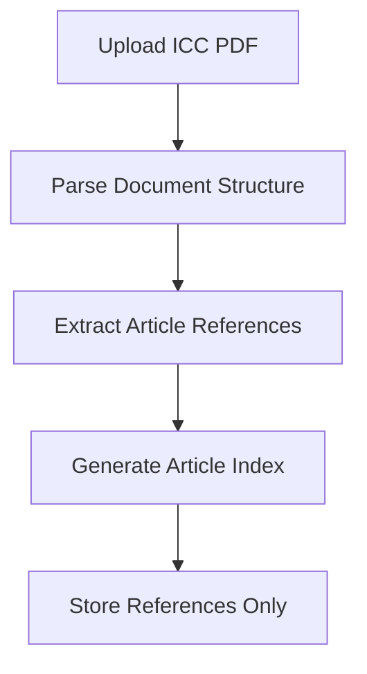
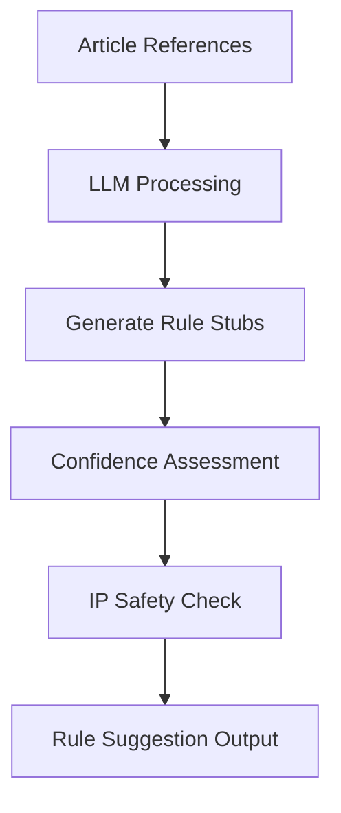
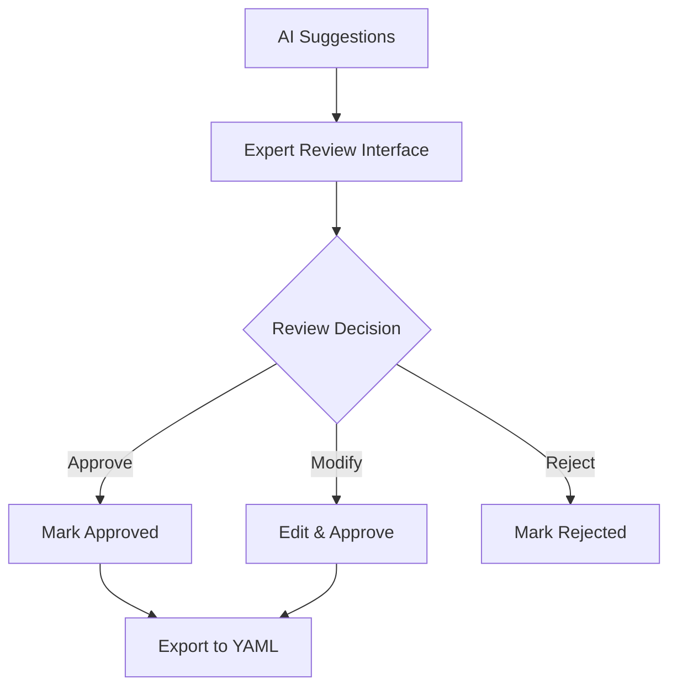
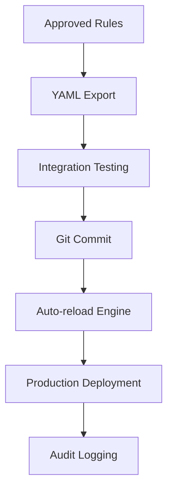

# AI-Assisted Rule Authoring Workflow

**LCopilot Trust Platform - Compliance Rule Generation System**

This document outlines the complete workflow for AI-assisted authoring of compliance rules from ICC documents while maintaining strict IP compliance standards.

## 🎯 Overview

The AI-assisted rule authoring system enables rapid generation of compliance rules from ICC publications (UCP600, ISBP, etc.) while ensuring:

- **IP Compliance**: No direct quotation of copyrighted ICC material
- **Human Oversight**: AI suggestions require expert review and approval
- **Quality Assurance**: Comprehensive validation and testing
- **Version Control**: Full audit trail and rollback capabilities

## 🔒 IP Compliance Principles

### ✅ Permitted Practices
- **Article References**: Reference ICC article numbers (e.g., "UCP600 Art. 14")
- **Paraphrasing**: Original descriptions of rule requirements
- **Functional Logic**: DSL expressions based on standard LC practices
- **Structure Extraction**: Parse article hierarchy without copying text

### ❌ Prohibited Practices
- **Direct Quotation**: Never copy ICC text verbatim
- **Long Excerpts**: Avoid reproducing substantial ICC content
- **Distribution**: Never share full ICC text externally
- **Storage**: Do not persist copyrighted material permanently

## 📋 Workflow Steps

### Step 1: Document Upload & Parsing



**Process:**
1. **Upload**: Legal team uploads ICC PDF (UCP600, ISBP, etc.)
2. **Parse**: System extracts article structure without storing full text
3. **Index**: Creates article reference database
4. **Validate**: Ensures no copyrighted text is retained

**Tools Used:**
- `icc_parser.py` - PDF structure extraction
- Legal validation checklist
- Automatic IP compliance scanning

**Deliverables:**
- Article reference index (JSON)
- Structure metadata only
- No full ICC text stored

### Step 2: AI Rule Suggestion



**Process:**
1. **Context Building**: AI receives article references and keywords only
2. **Rule Generation**: LLM creates original rule implementations
3. **Confidence Scoring**: System rates suggestion quality
4. **Safety Validation**: Ensures output contains no copyrighted content

**AI Prompting Strategy:**
```
Input: Article ID, title, keywords only (NO full text)
Output: Original YAML rule stub with DSL expression
Constraint: Generate based on standard LC knowledge, not ICC text
```

**Tools Used:**
- `ai_rule_suggester.py` - LLM integration
- OpenAI GPT-4 or Anthropic Claude
- IP compliance validation

**Deliverables:**
- YAML rule suggestions
- Confidence ratings
- IP compliance certification

### Step 3: Expert Review & Approval



**Process:**
1. **Interface**: Web dashboard displays suggestions side-by-side with references
2. **Review**: Compliance expert evaluates each suggestion
3. **Actions**: Approve, modify, or reject each rule
4. **Validation**: Real-time linting and syntax checking

**Review Criteria:**
- ✅ Functional accuracy for trade finance compliance
- ✅ IP-safe implementation (no ICC quotation)
- ✅ DSL syntax correctness
- ✅ Appropriate severity and field mappings
- ✅ Clear, actionable validation logic

**Tools Used:**
- `rule_review_dashboard/` - Web interface
- `rule_linter.py` - Real-time validation
- Flask dashboard with Bootstrap UI

**Deliverables:**
- Approved rule definitions (YAML)
- Review audit trail
- Expert validation signatures

### Step 4: Integration & Deployment



**Process:**
1. **Export**: Approved rules exported to production YAML format
2. **Testing**: Automated validation against test fixtures
3. **Version Control**: Git commit with audit trail
4. **Deployment**: Live engine reload with new rules
5. **Monitoring**: Health checks and performance validation

**Quality Gates:**
- All exported rules pass linting validation
- Test fixtures demonstrate rule functionality
- No performance degradation in compliance engine
- Audit trail maintains IP compliance certification

**Tools Used:**
- `rule_sync_service.py` - Live reload system
- Git version control integration
- Automated testing framework

**Deliverables:**
- Production-ready rule files
- Version control history
- Deployment audit logs

## 🛠️ Technical Implementation

### Core Components

#### 1. ICC Document Parser (`icc_parser.py`)
- **Purpose**: Extract article structure from ICC PDFs
- **IP Safety**: Never stores full text, only references
- **Output**: Article index with metadata only

```python
# Example usage
parser = ICCDocumentParser()
parsed_doc = parser.parse_document("ucp600.pdf")
# Outputs: Article references, structure, keywords only
```

#### 2. AI Rule Suggester (`ai_rule_suggester.py`)
- **Purpose**: Generate rule implementations from article references
- **Models**: OpenAI GPT-4, Anthropic Claude
- **Safety**: Built-in IP compliance validation

```python
# Example usage
suggester = AIRuleSuggester("openai")
suggestions = suggester.suggest_rules_from_document(parsed_doc)
# Outputs: Original YAML rule stubs with confidence ratings
```

#### 3. Review Dashboard (`rule_review_dashboard/`)
- **Purpose**: Web interface for expert review
- **Features**: Side-by-side comparison, real-time editing, audit trail
- **Technology**: Flask, Bootstrap, SQLite

```bash
# Start dashboard
cd rule_review_dashboard/
python app.py
# Access: http://localhost:5001
```

#### 4. Rule Sync Service (`rule_sync_service.py`)
- **Purpose**: Live engine updates and version control
- **Features**: File monitoring, Git integration, rollback capabilities
- **Monitoring**: Health checks, performance metrics

```python
# Example usage
sync_service = RuleSyncService(compliance_dir)
sync_service.start()  # Monitors for rule file changes
```

### Data Flow Architecture

```
┌─────────────┐    ┌──────────────┐    ┌─────────────┐
│   ICC PDF   │───▶│   Parser     │───▶│ References  │
│ (Temporary) │    │              │    │   (JSON)    │
└─────────────┘    └──────────────┘    └─────────────┘
                                              │
                                              ▼
┌─────────────┐    ┌──────────────┐    ┌─────────────┐
│  AI Model   │◀───│  Suggester   │◀───│  Keywords   │
│(GPT-4/Claude│    │              │    │  & Context  │
└─────────────┘    └──────────────┘    └─────────────┘
       │
       ▼
┌─────────────┐    ┌──────────────┐    ┌─────────────┐
│    YAML     │───▶│   Review     │───▶│  Approved   │
│ Suggestions │    │  Dashboard   │    │    Rules    │
└─────────────┘    └──────────────┘    └─────────────┘
                                              │
                                              ▼
┌─────────────┐    ┌──────────────┐    ┌─────────────┐
│  Production │◀───│ Sync Service │◀───│ Git Commit  │
│   Engine    │    │              │    │ & Deploy    │
└─────────────┘    └──────────────┘    └─────────────┘
```

## 📚 Usage Examples

### Example 1: Processing UCP600 Document

```bash
# 1. Upload and parse UCP600
python icc_parser.py --input ucp600.pdf --output ucp600_refs.json

# 2. Generate AI suggestions
python ai_rule_suggester.py --input ucp600_refs.json --output ucp600_suggestions.yaml

# 3. Review via dashboard
cd rule_review_dashboard/
python app.py
# Navigate to http://localhost:5001/review/1

# 4. Export approved rules
# Download approved_ucp600_rules.yaml from dashboard

# 5. Deploy to production
cp approved_ucp600_rules.yaml ../rules/
# Rule sync service auto-detects and reloads engine
```

### Example 2: Custom Rule Modification

```yaml
# Before: AI Suggestion
- id: "UCP600-14"
  title: "Document Examination Standard"  # AI generated
  dsl: "exists(documents) && not_empty(documents)"  # Basic
  confidence: "medium"

# After: Expert Review
- id: "UCP600-14"
  title: "Document Face Compliance Check"  # Human refined
  dsl: "exists(required_documents) && length(required_documents) > 0 && exists(presentation_period)"  # Enhanced
  severity: "high"  # Expert added
  reviewer_notes: "Enhanced to check presentation period requirement"
```

## 🔍 Quality Assurance

### Validation Checklist

**IP Compliance:**
- [ ] No direct ICC text quotation in any output
- [ ] All descriptions use original language
- [ ] References include only article numbers
- [ ] Legal team sign-off on IP compliance

**Technical Quality:**
- [ ] All DSL expressions validate syntactically
- [ ] Handler functions have proper signatures
- [ ] Test fixtures demonstrate rule functionality
- [ ] Performance benchmarks meet requirements

**Business Logic:**
- [ ] Rules accurately reflect trade finance practices
- [ ] Severity levels align with business impact
- [ ] Field mappings match LC document structure
- [ ] Edge cases properly handled

### Testing Framework

```python
# Automated validation of generated rules
def test_generated_rule(rule_yaml):
    # 1. Syntax validation
    assert validate_yaml_structure(rule_yaml)

    # 2. DSL validation
    assert validate_dsl_expression(rule_yaml['dsl'])

    # 3. IP compliance
    assert no_copyrighted_content(rule_yaml)

    # 4. Functional testing
    assert test_rule_with_fixtures(rule_yaml)
```

## 📊 Monitoring & Analytics

### Key Metrics

**Productivity:**
- Rules generated per hour
- AI suggestion accuracy rate
- Expert review time per rule
- End-to-end workflow duration

**Quality:**
- Rule validation pass rate
- Production deployment success rate
- Post-deployment issue rate
- IP compliance audit results

**Performance:**
- Engine reload time after rule updates
- Dashboard response times
- AI suggestion generation speed
- File monitoring latency

### Audit Trail

```json
{
  "rule_id": "UCP600-14",
  "workflow_events": [
    {
      "timestamp": "2024-01-15T10:00:00Z",
      "event": "ai_suggestion_generated",
      "confidence": "high",
      "model_used": "gpt-4"
    },
    {
      "timestamp": "2024-01-15T14:30:00Z",
      "event": "expert_review_completed",
      "reviewer": "jane.doe@lccopilot.com",
      "action": "approved_with_modifications"
    },
    {
      "timestamp": "2024-01-15T15:00:00Z",
      "event": "deployed_to_production",
      "git_commit": "a1b2c3d4",
      "ip_compliance_verified": true
    }
  ]
}
```

## 🚀 Getting Started

### Prerequisites

```bash
# Install dependencies
pip install PyPDF2 pdfminer.six openai anthropic flask watchdog

# Set API keys
export OPENAI_API_KEY="your-openai-key"
export ANTHROPIC_API_KEY="your-anthropic-key"

# Initialize database
cd rule_review_dashboard/
python app.py init-db
```

### Quick Start Guide

1. **Set up environment**:
   ```bash
   cd trust_platform/compliance/
   pip install -r requirements.txt
   ```

2. **Start services**:
   ```bash
   # Terminal 1: Review dashboard
   cd rule_review_dashboard/
   python app.py

   # Terminal 2: Rule sync service
   python rule_sync_service.py
   ```

3. **Upload first document**:
   - Navigate to http://localhost:5001
   - Click "Upload ICC Document"
   - Select UCP600 or ISBP PDF
   - Wait for AI processing

4. **Review suggestions**:
   - Go to review interface
   - Examine AI suggestions
   - Approve, modify, or reject each rule
   - Export approved rules

5. **Deploy to production**:
   - Rules automatically sync to engine
   - Monitor deployment via sync service
   - Validate with test LC documents

### Best Practices

**For Legal Teams:**
- Always verify IP compliance before final approval
- Maintain documentation of review process
- Regular audits of deployed rules
- Keep ICC source documents secure and access-controlled

**For Compliance Experts:**
- Focus on functional accuracy over AI suggestions
- Add business context and severity assessments
- Create comprehensive test scenarios
- Document edge cases and exceptions

**For Technical Teams:**
- Monitor system performance and reliability
- Maintain backup and rollback procedures
- Keep audit logs for compliance purposes
- Regular security reviews of AI integrations

## 🔧 Troubleshooting

### Common Issues

**AI Suggestions Low Quality:**
- Check API key configuration
- Verify article parsing accuracy
- Adjust confidence thresholds
- Review prompt engineering

**Dashboard Performance Issues:**
- Check database connection
- Monitor file upload limits
- Verify static file serving
- Scale Flask with Gunicorn for production

**Rule Sync Failures:**
- Validate YAML syntax
- Check file permissions
- Verify Git configuration
- Monitor disk space

**IP Compliance Concerns:**
- Review AI output for ICC text
- Validate export content
- Check audit trail completeness
- Engage legal team immediately

### Support Contacts

- **Technical Issues**: engineering@lcopilot.com
- **IP Compliance**: legal@lcopilot.com
- **Business Logic**: compliance@lcopilot.com
- **Emergency**: compliance-urgent@lcopilot.com

---

## 📋 Appendices

### Appendix A: IP Compliance Certificate Template

```
IP COMPLIANCE CERTIFICATION

Document: [Rule Export Filename]
Date: [Export Date]
Reviewer: [Legal Team Member]

CERTIFICATION:
☑ No direct ICC text quotation present
☑ All content represents original paraphrasing
☑ Article references use numbers only
☑ Source ICC documents handled securely
☑ Export approved for production use

Legal Signature: ________________
Date: ___________
```

### Appendix B: DSL Function Reference

| Function | Purpose | Example |
|----------|---------|---------|
| `exists(field)` | Check field presence | `exists(expiry_date)` |
| `not_empty(field)` | Validate non-empty | `not_empty(beneficiary.name)` |
| `contains(field, text)` | Text search | `contains(documents, "invoice")` |
| `dateWithinDays(date, days)` | Date range check | `dateWithinDays(expiry_date, 30)` |
| `amountGreaterThan(amt, value)` | Amount validation | `amountGreaterThan(amount.value, 0)` |

### Appendix C: Git Integration Commands

```bash
# Initialize rule repository
git init
git remote add origin [repo-url]

# Configure auto-commit
export RULE_AUTO_COMMIT=true

# Manual commit workflow
git add rules/
git commit -m "feat: Add UCP600 compliance rules

- Implemented 8 core UCP600 validations
- Added presentation period handler
- IP compliance verified by legal team"

git push origin main
```

---

**Document Version**: 1.0
**Last Updated**: 2024-12-20
**Next Review**: 2025-03-20

*This workflow maintains strict IP compliance with ICC copyrighted materials while enabling efficient rule development through AI assistance.*