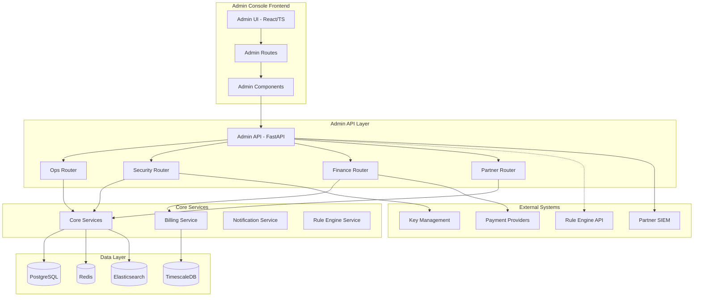
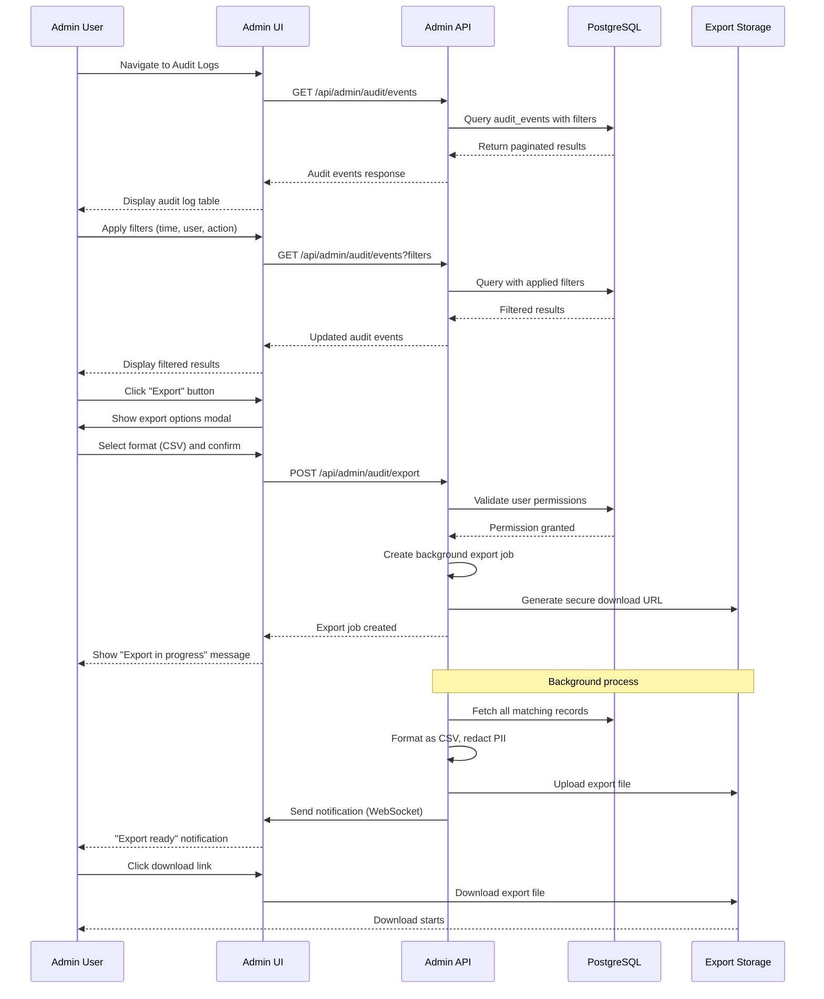
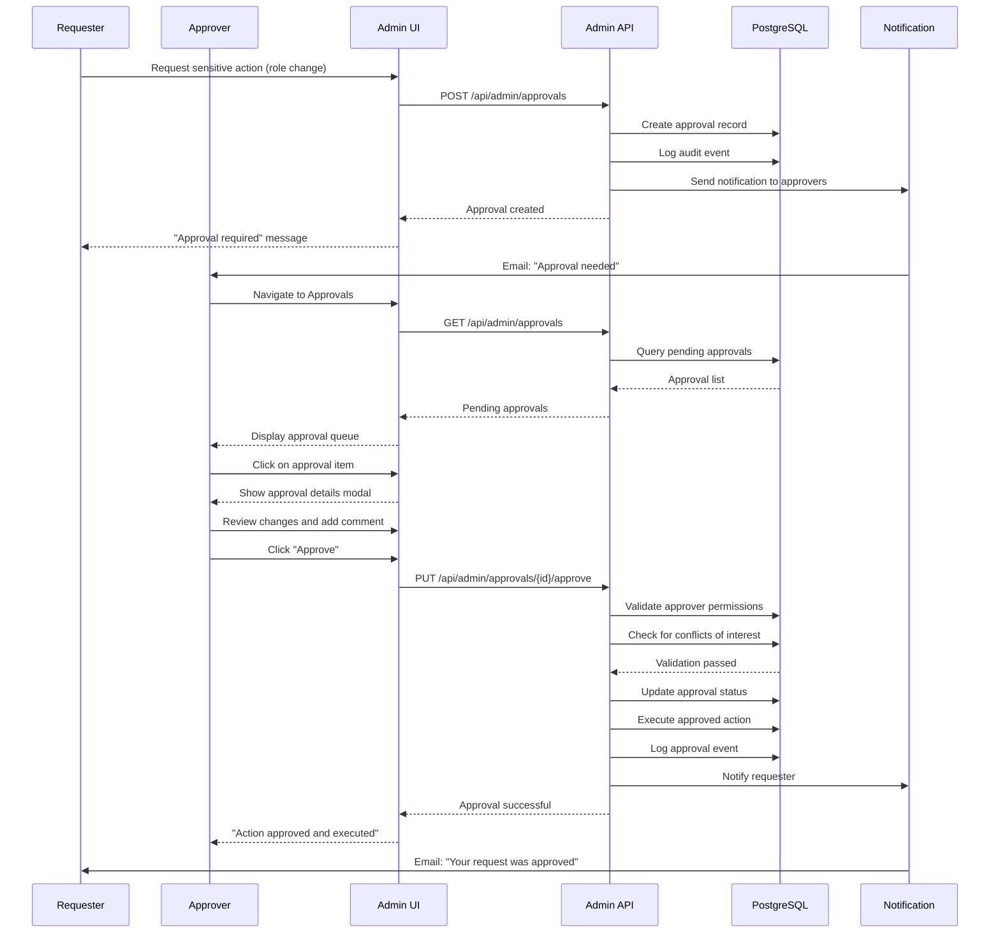
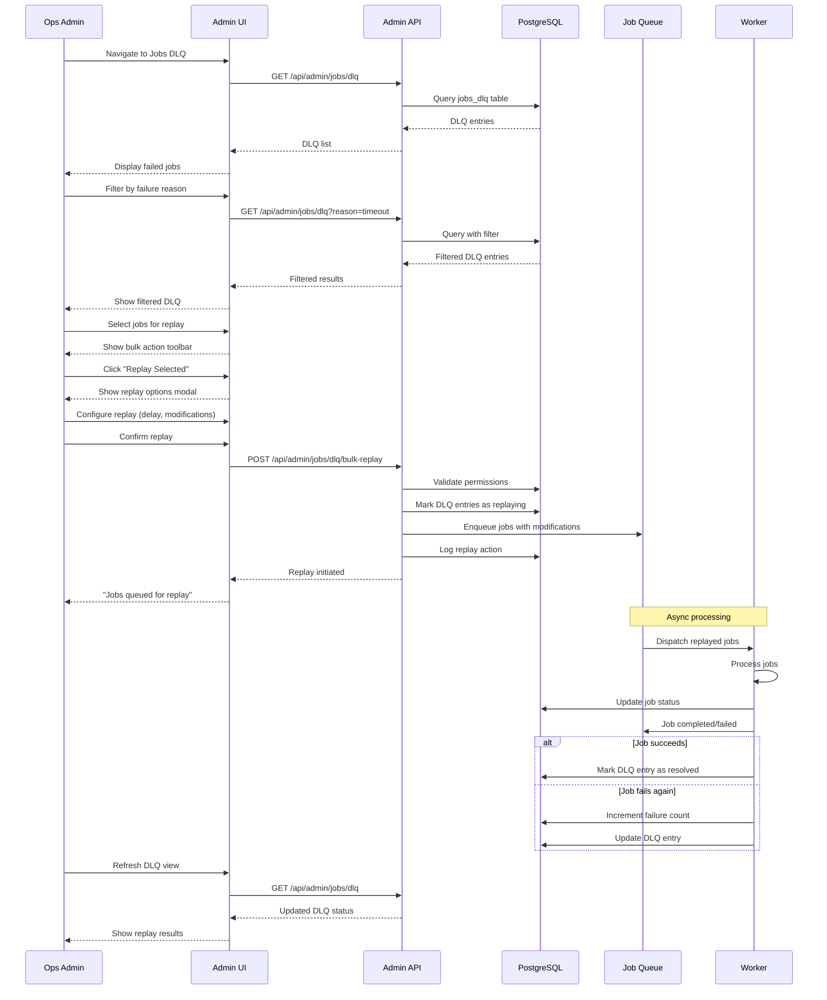
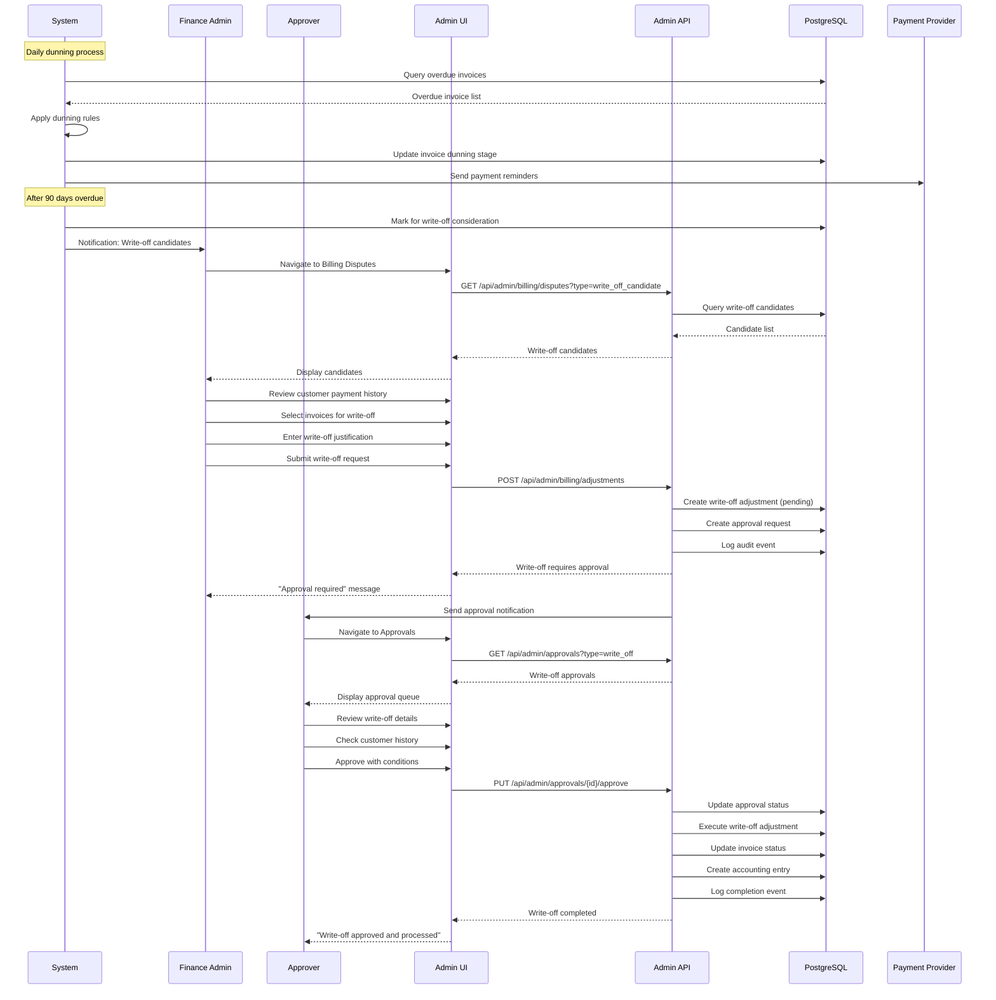
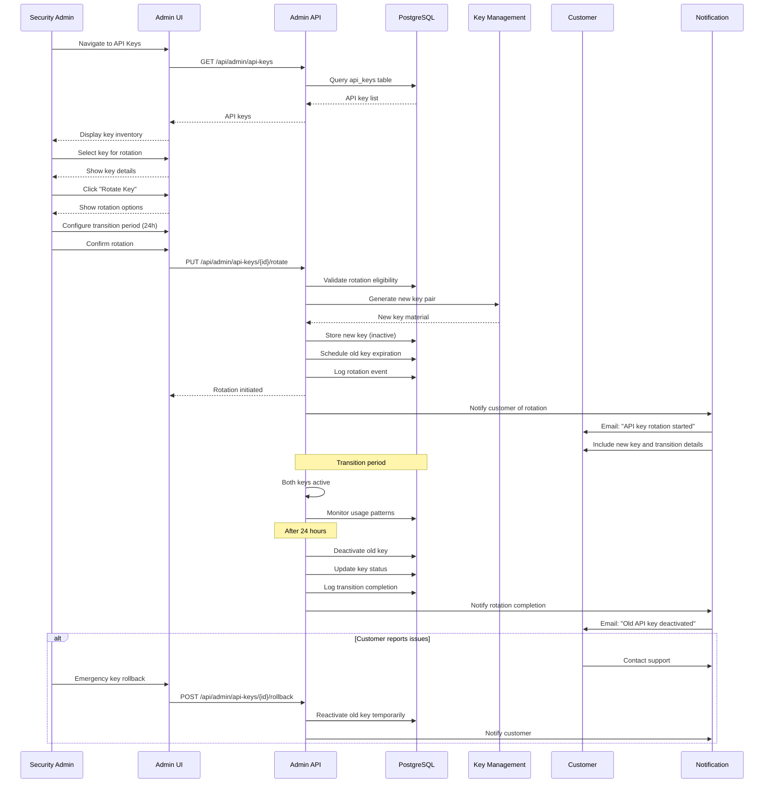

# LCopilot Admin Console - Phase 7 Specification

## Overview

The LCopilot Admin Console is an internal operator console for managing the entire LCopilot platform. It provides comprehensive tools for operations, security, finance, compliance, and system administration while maintaining strict RBAC controls and audit trails.

**Key Principles:**
- **Enterprise Security**: Fine-grained RBAC with 4-eyes approval workflows
- **Operational Excellence**: Real-time monitoring, alerting, and incident management
- **Compliance First**: Immutable audit trails, data residency, GDPR compliance
- **Business Intelligence**: Revenue analytics, risk insights, customer success metrics
- **Developer Experience**: Feature flags, release management, API observability

---

## Architecture Overview



## Key Flow Diagrams

### 1. Audit Log Search and Export Flow



### 2. 4-Eyes Approval Workflow



### 3. Job DLQ Replay Flow



### 4. Dunning to Write-off with Approval



### 5. API Key Rotation with Secret Distribution



---

## Prioritization Matrix

| Component | Phase | Rationale | Acceptance Criteria |
|-----------|-------|-----------|-------------------|
| **Audit Log Explorer** | **NOW** | Essential for compliance & debugging | Search/filter/export working with 100K+ records |
| **4-Eyes Approval System** | **NOW** | Risk mitigation for critical changes | Role changes, billing, security require approval |
| **Jobs Queue & DLQ Management** | **NOW** | Operational reliability | View, retry, replay failed jobs |
| **Billing Admin Core** | **NOW** | Revenue protection | Plans, credits, refunds with approval workflows |
| **API Keys & Session Management** | **NOW** | Security fundamentals | Create, rotate, revoke with audit trail |
| **Basic KPIs Dashboard** | **NOW** | Operational visibility | Uptime, latency, error rates, p95/p99 |
| **Feature Flags Management** | **NOW** | Safe deployment control | Toggle features by tenant/role/region |
| **User & Tenant CRUD** | **NOW** | Platform administration | Create, suspend, merge with proper RBAC |
| **Partner Registry Basic** | **NEXT** | Integration management | Credentials, health, basic webhook delivery |
| **Data Residency Controls** | **NEXT** | Compliance requirement | BD/EU/SG routing with policy enforcement |
| **LLM Ops Dashboard** | **NEXT** | AI cost control | Token budgets, model routing, safety filters |
| **Dunning & Collections** | **NEXT** | Revenue recovery | Automated flows with manual override |
| **DR & Backup Console** | **NEXT** | Business continuity | Point-in-time recovery, failover testing |
| **Fraud Detection Dashboard** | **LATER** | Advanced security | Anomaly detection, risk scoring |
| **Revenue Cohort Analysis** | **LATER** | Business intelligence | ARPU, NRR, churn prediction |
| **BI Connectors** | **LATER** | Enterprise integration | Snowflake, BigQuery export jobs |
| **Postmortem Workspace** | **LATER** | Incident management | Template-driven root cause analysis |

---

## Database Schema Updates

### Admin Core Tables

```sql
-- Admin roles and permissions
CREATE TABLE admin_roles (
    id UUID PRIMARY KEY DEFAULT gen_random_uuid(),
    name VARCHAR(100) NOT NULL UNIQUE,
    description TEXT,
    permissions JSONB NOT NULL DEFAULT '[]',
    created_at TIMESTAMP WITH TIME ZONE DEFAULT NOW(),
    updated_at TIMESTAMP WITH TIME ZONE DEFAULT NOW()
);

CREATE TABLE admin_users (
    id UUID PRIMARY KEY DEFAULT gen_random_uuid(),
    user_id UUID NOT NULL REFERENCES users(id),
    role_id UUID NOT NULL REFERENCES admin_roles(id),
    granted_by UUID REFERENCES users(id),
    granted_at TIMESTAMP WITH TIME ZONE DEFAULT NOW(),
    expires_at TIMESTAMP WITH TIME ZONE,
    is_active BOOLEAN DEFAULT true,
    created_at TIMESTAMP WITH TIME ZONE DEFAULT NOW()
);

-- Global audit log (append-only)
CREATE TABLE audit_events (
    id UUID PRIMARY KEY DEFAULT gen_random_uuid(),
    event_type VARCHAR(100) NOT NULL,
    actor_id UUID REFERENCES users(id),
    actor_type VARCHAR(50) NOT NULL DEFAULT 'user',
    resource_type VARCHAR(100) NOT NULL,
    resource_id VARCHAR(255),
    organization_id UUID REFERENCES organizations(id),
    action VARCHAR(100) NOT NULL,
    changes JSONB,
    metadata JSONB DEFAULT '{}',
    ip_address INET,
    user_agent TEXT,
    session_id VARCHAR(255),
    created_at TIMESTAMP WITH TIME ZONE DEFAULT NOW()
);

-- Partition by month for performance
CREATE TABLE audit_events_y2024m01 PARTITION OF audit_events
FOR VALUES FROM ('2024-01-01') TO ('2024-02-01');

-- 4-eyes approval system
CREATE TABLE approvals (
    id UUID PRIMARY KEY DEFAULT gen_random_uuid(),
    request_type VARCHAR(100) NOT NULL,
    resource_type VARCHAR(100) NOT NULL,
    resource_id VARCHAR(255) NOT NULL,
    requester_id UUID NOT NULL REFERENCES users(id),
    approver_id UUID REFERENCES users(id),
    status approval_status NOT NULL DEFAULT 'pending',
    requested_changes JSONB NOT NULL,
    approval_reason TEXT,
    rejection_reason TEXT,
    auto_expires_at TIMESTAMP WITH TIME ZONE,
    approved_at TIMESTAMP WITH TIME ZONE,
    rejected_at TIMESTAMP WITH TIME ZONE,
    created_at TIMESTAMP WITH TIME ZONE DEFAULT NOW(),
    updated_at TIMESTAMP WITH TIME ZONE DEFAULT NOW()
);

CREATE TYPE approval_status AS ENUM ('pending', 'approved', 'rejected', 'expired', 'cancelled');

-- Break glass access
CREATE TABLE break_glass_events (
    id UUID PRIMARY KEY DEFAULT gen_random_uuid(),
    user_id UUID NOT NULL REFERENCES users(id),
    reason TEXT NOT NULL,
    resource_type VARCHAR(100) NOT NULL,
    resource_id VARCHAR(255) NOT NULL,
    granted_permissions JSONB NOT NULL,
    approved_by UUID REFERENCES users(id),
    expires_at TIMESTAMP WITH TIME ZONE NOT NULL,
    revoked_at TIMESTAMP WITH TIME ZONE,
    revoked_by UUID REFERENCES users(id),
    created_at TIMESTAMP WITH TIME ZONE DEFAULT NOW()
);
```

### Jobs & Workflow Tables

```sql
-- Job queue management
CREATE TABLE jobs_queue (
    id UUID PRIMARY KEY DEFAULT gen_random_uuid(),
    job_type VARCHAR(100) NOT NULL,
    job_data JSONB NOT NULL,
    priority INTEGER DEFAULT 5,
    status job_status DEFAULT 'queued',
    attempts INTEGER DEFAULT 0,
    max_attempts INTEGER DEFAULT 3,
    scheduled_at TIMESTAMP WITH TIME ZONE DEFAULT NOW(),
    started_at TIMESTAMP WITH TIME ZONE,
    completed_at TIMESTAMP WITH TIME ZONE,
    failed_at TIMESTAMP WITH TIME ZONE,
    error_message TEXT,
    error_stack TEXT,
    worker_id VARCHAR(255),
    organization_id UUID REFERENCES organizations(id),
    user_id UUID REFERENCES users(id),
    lc_id VARCHAR(255),
    created_at TIMESTAMP WITH TIME ZONE DEFAULT NOW(),
    updated_at TIMESTAMP WITH TIME ZONE DEFAULT NOW()
);

CREATE TYPE job_status AS ENUM ('queued', 'running', 'completed', 'failed', 'cancelled', 'retrying');

-- Dead letter queue
CREATE TABLE jobs_dlq (
    id UUID PRIMARY KEY DEFAULT gen_random_uuid(),
    original_job_id UUID NOT NULL,
    job_type VARCHAR(100) NOT NULL,
    job_data JSONB NOT NULL,
    failure_reason TEXT NOT NULL,
    failure_count INTEGER NOT NULL,
    last_error TEXT,
    quarantine_reason TEXT,
    can_retry BOOLEAN DEFAULT true,
    retry_after TIMESTAMP WITH TIME ZONE,
    resolved_at TIMESTAMP WITH TIME ZONE,
    resolved_by UUID REFERENCES users(id),
    created_at TIMESTAMP WITH TIME ZONE DEFAULT NOW()
);

-- Job execution history
CREATE TABLE jobs_history (
    id UUID PRIMARY KEY DEFAULT gen_random_uuid(),
    job_id UUID NOT NULL,
    status job_status NOT NULL,
    duration_ms INTEGER,
    memory_mb INTEGER,
    cpu_percent DECIMAL(5,2),
    step_name VARCHAR(100),
    step_data JSONB,
    created_at TIMESTAMP WITH TIME ZONE DEFAULT NOW()
);
```

### Billing & Finance Tables

```sql
-- Billing adjustments and credits
CREATE TABLE billing_adjustments (
    id UUID PRIMARY KEY DEFAULT gen_random_uuid(),
    organization_id UUID NOT NULL REFERENCES organizations(id),
    type adjustment_type NOT NULL,
    amount_usd DECIMAL(12,2) NOT NULL,
    reason TEXT NOT NULL,
    reference_invoice_id UUID,
    applied_by UUID NOT NULL REFERENCES users(id),
    approved_by UUID REFERENCES users(id),
    status adjustment_status DEFAULT 'pending',
    metadata JSONB DEFAULT '{}',
    created_at TIMESTAMP WITH TIME ZONE DEFAULT NOW(),
    approved_at TIMESTAMP WITH TIME ZONE
);

CREATE TYPE adjustment_type AS ENUM ('credit', 'debit', 'refund', 'write_off', 'promotional');
CREATE TYPE adjustment_status AS ENUM ('pending', 'approved', 'rejected', 'applied');

-- Credits and promotions
CREATE TABLE credits (
    id UUID PRIMARY KEY DEFAULT gen_random_uuid(),
    code VARCHAR(50) UNIQUE NOT NULL,
    type credit_type NOT NULL,
    value_usd DECIMAL(12,2),
    percentage INTEGER,
    min_spend_usd DECIMAL(12,2),
    max_uses INTEGER,
    uses_count INTEGER DEFAULT 0,
    valid_from TIMESTAMP WITH TIME ZONE DEFAULT NOW(),
    valid_until TIMESTAMP WITH TIME ZONE,
    applicable_plans TEXT[],
    created_by UUID NOT NULL REFERENCES users(id),
    is_active BOOLEAN DEFAULT true,
    metadata JSONB DEFAULT '{}',
    created_at TIMESTAMP WITH TIME ZONE DEFAULT NOW()
);

CREATE TYPE credit_type AS ENUM ('fixed_amount', 'percentage', 'free_tier_upgrade');

-- Disputes and chargebacks
CREATE TABLE disputes (
    id UUID PRIMARY KEY DEFAULT gen_random_uuid(),
    invoice_id UUID NOT NULL,
    organization_id UUID NOT NULL REFERENCES organizations(id),
    type dispute_type NOT NULL,
    amount_usd DECIMAL(12,2) NOT NULL,
    reason TEXT NOT NULL,
    evidence_url TEXT,
    status dispute_status DEFAULT 'open',
    assigned_to UUID REFERENCES users(id),
    resolved_by UUID REFERENCES users(id),
    resolution_notes TEXT,
    created_at TIMESTAMP WITH TIME ZONE DEFAULT NOW(),
    resolved_at TIMESTAMP WITH TIME ZONE
);

CREATE TYPE dispute_type AS ENUM ('chargeback', 'inquiry', 'quality_dispute', 'billing_error');
CREATE TYPE dispute_status AS ENUM ('open', 'investigating', 'resolved', 'escalated');
```

### Partner & Integration Tables

```sql
-- Partner registry
CREATE TABLE partner_registry (
    id UUID PRIMARY KEY DEFAULT gen_random_uuid(),
    name VARCHAR(200) NOT NULL,
    type partner_type NOT NULL,
    environment environment_type DEFAULT 'sandbox',
    status partner_status DEFAULT 'active',
    api_endpoint TEXT,
    auth_config JSONB NOT NULL DEFAULT '{}',
    rate_limits JSONB DEFAULT '{}',
    sla_config JSONB DEFAULT '{}',
    contact_email VARCHAR(255),
    contact_phone VARCHAR(50),
    technical_contact JSONB,
    business_contact JSONB,
    onboarded_at TIMESTAMP WITH TIME ZONE,
    last_health_check TIMESTAMP WITH TIME ZONE,
    health_status VARCHAR(20) DEFAULT 'unknown',
    metadata JSONB DEFAULT '{}',
    created_at TIMESTAMP WITH TIME ZONE DEFAULT NOW(),
    updated_at TIMESTAMP WITH TIME ZONE DEFAULT NOW()
);

CREATE TYPE partner_type AS ENUM ('bank', 'customs', 'logistics', 'payment', 'data_provider');
CREATE TYPE environment_type AS ENUM ('sandbox', 'staging', 'production');
CREATE TYPE partner_status AS ENUM ('active', 'inactive', 'suspended', 'deprecated');

-- Partner connectors health
CREATE TABLE partner_connectors (
    id UUID PRIMARY KEY DEFAULT gen_random_uuid(),
    partner_id UUID NOT NULL REFERENCES partner_registry(id),
    connector_type VARCHAR(100) NOT NULL,
    version VARCHAR(20) NOT NULL,
    config JSONB NOT NULL DEFAULT '{}',
    health_endpoint TEXT,
    last_success_at TIMESTAMP WITH TIME ZONE,
    last_failure_at TIMESTAMP WITH TIME ZONE,
    success_count INTEGER DEFAULT 0,
    failure_count INTEGER DEFAULT 0,
    avg_response_time_ms INTEGER,
    uptime_percentage DECIMAL(5,2),
    status connector_status DEFAULT 'unknown',
    created_at TIMESTAMP WITH TIME ZONE DEFAULT NOW(),
    updated_at TIMESTAMP WITH TIME ZONE DEFAULT NOW()
);

CREATE TYPE connector_status AS ENUM ('healthy', 'degraded', 'down', 'unknown');

-- Webhook deliveries
CREATE TABLE webhook_deliveries (
    id UUID PRIMARY KEY DEFAULT gen_random_uuid(),
    partner_id UUID NOT NULL REFERENCES partner_registry(id),
    webhook_url TEXT NOT NULL,
    event_type VARCHAR(100) NOT NULL,
    payload JSONB NOT NULL,
    headers JSONB DEFAULT '{}',
    http_status INTEGER,
    response_body TEXT,
    delivery_time_ms INTEGER,
    attempts INTEGER DEFAULT 1,
    max_attempts INTEGER DEFAULT 3,
    status delivery_status DEFAULT 'pending',
    next_retry_at TIMESTAMP WITH TIME ZONE,
    delivered_at TIMESTAMP WITH TIME ZONE,
    failed_at TIMESTAMP WITH TIME ZONE,
    created_at TIMESTAMP WITH TIME ZONE DEFAULT NOW()
);

CREATE TYPE delivery_status AS ENUM ('pending', 'delivered', 'failed', 'retrying', 'abandoned');

-- Webhook DLQ
CREATE TABLE webhook_dlq (
    id UUID PRIMARY KEY DEFAULT gen_random_uuid(),
    original_delivery_id UUID NOT NULL REFERENCES webhook_deliveries(id),
    partner_id UUID NOT NULL REFERENCES partner_registry(id),
    webhook_url TEXT NOT NULL,
    event_type VARCHAR(100) NOT NULL,
    payload JSONB NOT NULL,
    failure_reason TEXT NOT NULL,
    failure_count INTEGER NOT NULL,
    can_replay BOOLEAN DEFAULT true,
    resolved_at TIMESTAMP WITH TIME ZONE,
    resolved_by UUID REFERENCES users(id),
    created_at TIMESTAMP WITH TIME ZONE DEFAULT NOW()
);
```

### Security & Access Tables

```sql
-- API Keys management
CREATE TABLE api_keys (
    id UUID PRIMARY KEY DEFAULT gen_random_uuid(),
    name VARCHAR(200) NOT NULL,
    key_hash VARCHAR(255) NOT NULL UNIQUE,
    key_prefix VARCHAR(20) NOT NULL,
    organization_id UUID NOT NULL REFERENCES organizations(id),
    created_by UUID NOT NULL REFERENCES users(id),
    scopes TEXT[] NOT NULL DEFAULT '{}',
    rate_limit INTEGER DEFAULT 1000,
    expires_at TIMESTAMP WITH TIME ZONE,
    last_used_at TIMESTAMP WITH TIME ZONE,
    last_used_ip INET,
    is_active BOOLEAN DEFAULT true,
    usage_count INTEGER DEFAULT 0,
    created_at TIMESTAMP WITH TIME ZONE DEFAULT NOW(),
    updated_at TIMESTAMP WITH TIME ZONE DEFAULT NOW()
);

-- Service accounts
CREATE TABLE service_accounts (
    id UUID PRIMARY KEY DEFAULT gen_random_uuid(),
    name VARCHAR(200) NOT NULL,
    description TEXT,
    type service_account_type DEFAULT 'internal',
    permissions JSONB NOT NULL DEFAULT '[]',
    ip_allowlist TEXT[],
    created_by UUID NOT NULL REFERENCES users(id),
    is_active BOOLEAN DEFAULT true,
    last_rotation_at TIMESTAMP WITH TIME ZONE,
    next_rotation_due TIMESTAMP WITH TIME ZONE,
    metadata JSONB DEFAULT '{}',
    created_at TIMESTAMP WITH TIME ZONE DEFAULT NOW()
);

CREATE TYPE service_account_type AS ENUM ('internal', 'partner', 'webhook', 'backup');

-- IP allowlists
CREATE TABLE ip_allowlists (
    id UUID PRIMARY KEY DEFAULT gen_random_uuid(),
    name VARCHAR(200) NOT NULL,
    description TEXT,
    organization_id UUID REFERENCES organizations(id),
    ip_ranges JSONB NOT NULL, -- Array of CIDR blocks
    is_global BOOLEAN DEFAULT false,
    created_by UUID NOT NULL REFERENCES users(id),
    is_active BOOLEAN DEFAULT true,
    metadata JSONB DEFAULT '{}',
    created_at TIMESTAMP WITH TIME ZONE DEFAULT NOW(),
    updated_at TIMESTAMP WITH TIME ZONE DEFAULT NOW()
);

-- Session management
CREATE TABLE user_sessions (
    id UUID PRIMARY KEY DEFAULT gen_random_uuid(),
    user_id UUID NOT NULL REFERENCES users(id),
    session_token_hash VARCHAR(255) NOT NULL UNIQUE,
    device_info JSONB DEFAULT '{}',
    ip_address INET NOT NULL,
    user_agent TEXT,
    location JSONB, -- Country, city from IP
    is_active BOOLEAN DEFAULT true,
    last_activity_at TIMESTAMP WITH TIME ZONE DEFAULT NOW(),
    expires_at TIMESTAMP WITH TIME ZONE NOT NULL,
    created_at TIMESTAMP WITH TIME ZONE DEFAULT NOW()
);
```

### Compliance & Data Tables

```sql
-- Data residency policies
CREATE TABLE data_residency_policies (
    id UUID PRIMARY KEY DEFAULT gen_random_uuid(),
    organization_id UUID NOT NULL REFERENCES organizations(id),
    region data_region NOT NULL,
    data_types TEXT[] NOT NULL,
    storage_location VARCHAR(100) NOT NULL,
    encryption_key_id VARCHAR(255),
    compliance_frameworks TEXT[],
    policy_document_url TEXT,
    is_active BOOLEAN DEFAULT true,
    effective_from TIMESTAMP WITH TIME ZONE DEFAULT NOW(),
    created_by UUID NOT NULL REFERENCES users(id),
    approved_by UUID REFERENCES users(id),
    metadata JSONB DEFAULT '{}',
    created_at TIMESTAMP WITH TIME ZONE DEFAULT NOW()
);

CREATE TYPE data_region AS ENUM ('BD', 'EU', 'SG', 'US', 'GLOBAL');

-- Retention policies
CREATE TABLE retention_policies (
    id UUID PRIMARY KEY DEFAULT gen_random_uuid(),
    name VARCHAR(200) NOT NULL,
    data_type VARCHAR(100) NOT NULL,
    retention_period_days INTEGER NOT NULL,
    archive_after_days INTEGER,
    delete_after_days INTEGER,
    legal_basis TEXT,
    applies_to_regions data_region[],
    is_active BOOLEAN DEFAULT true,
    created_by UUID NOT NULL REFERENCES users(id),
    approved_by UUID REFERENCES users(id),
    metadata JSONB DEFAULT '{}',
    created_at TIMESTAMP WITH TIME ZONE DEFAULT NOW()
);

-- Legal holds
CREATE TABLE legal_holds (
    id UUID PRIMARY KEY DEFAULT gen_random_uuid(),
    case_number VARCHAR(100) NOT NULL UNIQUE,
    title VARCHAR(500) NOT NULL,
    description TEXT,
    organization_id UUID REFERENCES organizations(id),
    data_types TEXT[] NOT NULL,
    date_range_start DATE,
    date_range_end DATE,
    custodian_users UUID[],
    search_terms TEXT[],
    status legal_hold_status DEFAULT 'active',
    created_by UUID NOT NULL REFERENCES users(id),
    legal_contact JSONB,
    metadata JSONB DEFAULT '{}',
    created_at TIMESTAMP WITH TIME ZONE DEFAULT NOW(),
    closed_at TIMESTAMP WITH TIME ZONE
);

CREATE TYPE legal_hold_status AS ENUM ('active', 'released', 'expired');
```

### LLM Ops Tables

```sql
-- LLM prompt library
CREATE TABLE llm_prompts (
    id UUID PRIMARY KEY DEFAULT gen_random_uuid(),
    name VARCHAR(200) NOT NULL,
    version VARCHAR(20) NOT NULL,
    prompt_type VARCHAR(100) NOT NULL,
    system_prompt TEXT NOT NULL,
    user_template TEXT NOT NULL,
    language prompt_language DEFAULT 'en',
    model_constraints JSONB DEFAULT '{}',
    safety_filters JSONB DEFAULT '{}',
    is_active BOOLEAN DEFAULT true,
    created_by UUID NOT NULL REFERENCES users(id),
    approved_by UUID REFERENCES users(id),
    test_results JSONB,
    performance_metrics JSONB,
    created_at TIMESTAMP WITH TIME ZONE DEFAULT NOW(),
    UNIQUE(name, version)
);

CREATE TYPE prompt_language AS ENUM ('en', 'bn', 'ar', 'zh');

-- LLM evaluation runs
CREATE TABLE llm_eval_runs (
    id UUID PRIMARY KEY DEFAULT gen_random_uuid(),
    prompt_id UUID NOT NULL REFERENCES llm_prompts(id),
    eval_set_name VARCHAR(200) NOT NULL,
    model_name VARCHAR(100) NOT NULL,
    test_cases_count INTEGER NOT NULL,
    passed_count INTEGER DEFAULT 0,
    failed_count INTEGER DEFAULT 0,
    avg_latency_ms INTEGER,
    avg_tokens_used INTEGER,
    cost_usd DECIMAL(10,4),
    quality_score DECIMAL(3,2),
    safety_score DECIMAL(3,2),
    detailed_results JSONB,
    run_by UUID NOT NULL REFERENCES users(id),
    created_at TIMESTAMP WITH TIME ZONE DEFAULT NOW()
);

-- LLM budgets and usage
CREATE TABLE llm_budgets (
    id UUID PRIMARY KEY DEFAULT gen_random_uuid(),
    organization_id UUID NOT NULL REFERENCES organizations(id),
    model_name VARCHAR(100) NOT NULL,
    budget_period budget_period DEFAULT 'monthly',
    budget_usd DECIMAL(10,2) NOT NULL,
    used_usd DECIMAL(10,2) DEFAULT 0,
    token_budget INTEGER,
    tokens_used INTEGER DEFAULT 0,
    alert_threshold_percent INTEGER DEFAULT 80,
    hard_limit_enabled BOOLEAN DEFAULT false,
    period_start DATE NOT NULL,
    period_end DATE NOT NULL,
    is_active BOOLEAN DEFAULT true,
    created_by UUID NOT NULL REFERENCES users(id),
    metadata JSONB DEFAULT '{}',
    created_at TIMESTAMP WITH TIME ZONE DEFAULT NOW()
);

CREATE TYPE budget_period AS ENUM ('daily', 'weekly', 'monthly', 'quarterly');
```

### Feature Flags & Release Tables

```sql
-- Feature flags
CREATE TABLE feature_flags (
    id UUID PRIMARY KEY DEFAULT gen_random_uuid(),
    name VARCHAR(200) NOT NULL UNIQUE,
    description TEXT,
    type flag_type DEFAULT 'boolean',
    default_value JSONB DEFAULT 'false',
    is_active BOOLEAN DEFAULT true,
    rollout_percentage INTEGER DEFAULT 0,
    targeting_rules JSONB DEFAULT '{}',
    created_by UUID NOT NULL REFERENCES users(id),
    metadata JSONB DEFAULT '{}',
    created_at TIMESTAMP WITH TIME ZONE DEFAULT NOW(),
    updated_at TIMESTAMP WITH TIME ZONE DEFAULT NOW()
);

CREATE TYPE flag_type AS ENUM ('boolean', 'string', 'number', 'json');

-- Feature flag evaluations
CREATE TABLE flag_evaluations (
    id UUID PRIMARY KEY DEFAULT gen_random_uuid(),
    flag_id UUID NOT NULL REFERENCES feature_flags(id),
    user_id UUID REFERENCES users(id),
    organization_id UUID REFERENCES organizations(id),
    evaluation_context JSONB DEFAULT '{}',
    result_value JSONB NOT NULL,
    evaluation_reason VARCHAR(100),
    created_at TIMESTAMP WITH TIME ZONE DEFAULT NOW()
);

-- Release notes
CREATE TABLE release_notes (
    id UUID PRIMARY KEY DEFAULT gen_random_uuid(),
    version VARCHAR(50) NOT NULL UNIQUE,
    title VARCHAR(500) NOT NULL,
    description TEXT,
    release_type release_type DEFAULT 'minor',
    features JSONB DEFAULT '[]',
    bug_fixes JSONB DEFAULT '[]',
    breaking_changes JSONB DEFAULT '[]',
    migration_notes TEXT,
    rollout_strategy JSONB DEFAULT '{}',
    published_by UUID NOT NULL REFERENCES users(id),
    published_at TIMESTAMP WITH TIME ZONE,
    is_published BOOLEAN DEFAULT false,
    metadata JSONB DEFAULT '{}',
    created_at TIMESTAMP WITH TIME ZONE DEFAULT NOW()
);

CREATE TYPE release_type AS ENUM ('major', 'minor', 'patch', 'hotfix');
```

### Indexes for Performance

```sql
-- Audit events indexes
CREATE INDEX idx_audit_events_created_at ON audit_events(created_at DESC);
CREATE INDEX idx_audit_events_actor_id ON audit_events(actor_id);
CREATE INDEX idx_audit_events_organization_id ON audit_events(organization_id);
CREATE INDEX idx_audit_events_resource ON audit_events(resource_type, resource_id);
CREATE INDEX idx_audit_events_action ON audit_events(action);

-- Jobs indexes
CREATE INDEX idx_jobs_queue_status_priority ON jobs_queue(status, priority DESC, scheduled_at);
CREATE INDEX idx_jobs_queue_organization_id ON jobs_queue(organization_id);
CREATE INDEX idx_jobs_queue_job_type ON jobs_queue(job_type);
CREATE INDEX idx_jobs_dlq_partner_id ON jobs_dlq(partner_id);

-- Billing indexes
CREATE INDEX idx_billing_adjustments_org_status ON billing_adjustments(organization_id, status);
CREATE INDEX idx_disputes_status_assigned ON disputes(status, assigned_to);

-- Partner indexes
CREATE INDEX idx_partner_registry_type_status ON partner_registry(type, status);
CREATE INDEX idx_webhook_deliveries_partner_status ON webhook_deliveries(partner_id, status);

-- API keys indexes
CREATE INDEX idx_api_keys_organization_active ON api_keys(organization_id, is_active);
CREATE INDEX idx_api_keys_key_hash ON api_keys(key_hash);

-- Feature flags indexes
CREATE INDEX idx_feature_flags_active ON feature_flags(is_active);
CREATE INDEX idx_flag_evaluations_flag_user ON flag_evaluations(flag_id, user_id, created_at DESC);
```

---

## API Endpoints Specification

### Authentication & Authorization

All Admin API endpoints require:
- **Authentication**: Bearer JWT token with admin claims
- **Authorization**: Specific admin permissions per endpoint
- **Audit Trail**: All operations logged to `audit_events`
- **Rate Limiting**: 1000 requests/hour per admin user

#### Admin Roles & Permissions

```python
ADMIN_PERMISSIONS = {
    "ops_admin": [
        "audit:read", "jobs:read", "jobs:write", "monitoring:read",
        "feature_flags:read", "feature_flags:write", "users:read"
    ],
    "security_admin": [
        "audit:read", "audit:export", "users:read", "users:write",
        "api_keys:read", "api_keys:write", "sessions:read", "sessions:write",
        "approvals:read", "approvals:write", "break_glass:read"
    ],
    "finance_admin": [
        "billing:read", "billing:write", "credits:read", "credits:write",
        "disputes:read", "disputes:write", "approvals:read", "approvals:write"
    ],
    "partner_admin": [
        "partners:read", "partners:write", "webhooks:read", "webhooks:write",
        "integrations:read", "integrations:write"
    ],
    "compliance_admin": [
        "audit:read", "audit:export", "data_residency:read", "data_residency:write",
        "retention:read", "retention:write", "legal_holds:read", "legal_holds:write"
    ],
    "super_admin": ["*"]  # All permissions
}
```

### 1. Ops & Observability Endpoints

#### KPIs Dashboard
```python
# GET /api/admin/ops/kpis
class KPIResponse(BaseModel):
    uptime_percentage: float
    avg_response_time_ms: int
    error_rate_percentage: float
    active_users_24h: int
    jobs_processed_24h: int
    revenue_24h_usd: float
    p95_latency_ms: int
    p99_latency_ms: int
    alerts_active: int

# GET /api/admin/ops/metrics
class MetricsQuery(BaseModel):
    metric_names: List[str]
    time_range: str = "24h"
    granularity: str = "1h"
    filters: Dict[str, Any] = {}
```

#### Logs & Traces
```python
# GET /api/admin/ops/logs
class LogQuery(BaseModel):
    level: Optional[str] = None
    service: Optional[str] = None
    time_start: Optional[datetime] = None
    time_end: Optional[datetime] = None
    query: Optional[str] = None
    limit: int = 100

# GET /api/admin/ops/traces/{trace_id}
# POST /api/admin/ops/logs/export
class LogExportRequest(BaseModel):
    query: LogQuery
    format: str = "json"  # json, csv, syslog
    redact_pii: bool = True
```

#### Alerts Management
```python
# GET /api/admin/ops/alerts
# POST /api/admin/ops/alerts
class AlertRule(BaseModel):
    name: str
    description: str
    metric: str
    threshold: float
    operator: str  # gt, lt, eq
    duration: str = "5m"
    severity: str  # critical, warning, info
    channels: List[str]  # email, slack, pagerduty

# PUT /api/admin/ops/alerts/{alert_id}/silence
class SilenceRequest(BaseModel):
    duration: str
    reason: str
```

### 2. Jobs & Workflow Endpoints

#### Queue Management
```python
# GET /api/admin/jobs/queue
class JobFilter(BaseModel):
    status: Optional[str] = None
    job_type: Optional[str] = None
    organization_id: Optional[str] = None
    created_after: Optional[datetime] = None
    limit: int = 50

# POST /api/admin/jobs/{job_id}/retry
# POST /api/admin/jobs/{job_id}/cancel
# POST /api/admin/jobs/bulk-retry
class BulkJobAction(BaseModel):
    job_ids: List[str]
    action: str  # retry, cancel, requeue
    reason: str
```

#### DLQ Management
```python
# GET /api/admin/jobs/dlq
# POST /api/admin/jobs/dlq/{dlq_id}/replay
class DLQReplayRequest(BaseModel):
    retry_count: int = 1
    delay_seconds: int = 0
    modify_payload: Optional[Dict[str, Any]] = None

# POST /api/admin/jobs/dlq/bulk-replay
class BulkDLQReplay(BaseModel):
    dlq_ids: List[str]
    strategy: str  # immediate, scheduled, throttled
    throttle_rate: Optional[int] = None  # jobs per minute
```

### 3. Audit & Governance Endpoints

#### Audit Log Explorer
```python
# GET /api/admin/audit/events
class AuditFilter(BaseModel):
    actor_id: Optional[str] = None
    organization_id: Optional[str] = None
    resource_type: Optional[str] = None
    action: Optional[str] = None
    time_start: Optional[datetime] = None
    time_end: Optional[datetime] = None
    ip_address: Optional[str] = None
    limit: int = 100

# POST /api/admin/audit/export
class AuditExportRequest(BaseModel):
    filters: AuditFilter
    format: str = "csv"  # csv, json, pdf
    include_pii: bool = False
    legal_hold_id: Optional[str] = None
```

#### Approval Workflows
```python
# GET /api/admin/approvals
# POST /api/admin/approvals
class ApprovalRequest(BaseModel):
    request_type: str
    resource_type: str
    resource_id: str
    requested_changes: Dict[str, Any]
    justification: str
    urgency: str = "normal"  # low, normal, high, urgent

# PUT /api/admin/approvals/{approval_id}/approve
# PUT /api/admin/approvals/{approval_id}/reject
class ApprovalDecision(BaseModel):
    decision: str  # approve, reject
    reason: str
    conditions: Optional[Dict[str, Any]] = None
```

#### Break Glass Access
```python
# POST /api/admin/break-glass/request
class BreakGlassRequest(BaseModel):
    resource_type: str
    resource_id: str
    permissions: List[str]
    reason: str
    duration_hours: int = 4
    emergency_contact: str

# PUT /api/admin/break-glass/{event_id}/revoke
class BreakGlassRevocation(BaseModel):
    reason: str
    immediate: bool = false
```

### 4. Security & Access Management Endpoints

#### User Management
```python
# GET /api/admin/users
# POST /api/admin/users
class AdminUserCreate(BaseModel):
    email: str
    name: str
    role: str
    organization_id: Optional[str] = None
    permissions: List[str] = []
    expires_at: Optional[datetime] = None

# PUT /api/admin/users/{user_id}/suspend
# PUT /api/admin/users/{user_id}/merge
class UserMergeRequest(BaseModel):
    target_user_id: str
    preserve_data: List[str] = []
    notification_email: str
```

#### API Keys Management
```python
# GET /api/admin/api-keys
# POST /api/admin/api-keys
class APIKeyCreate(BaseModel):
    name: str
    organization_id: str
    scopes: List[str]
    rate_limit: int = 1000
    expires_at: Optional[datetime] = None
    ip_allowlist: List[str] = []

# PUT /api/admin/api-keys/{key_id}/rotate
# PUT /api/admin/api-keys/{key_id}/revoke
class APIKeyRotation(BaseModel):
    new_scopes: Optional[List[str]] = None
    new_rate_limit: Optional[int] = None
    transition_period_hours: int = 24
```

#### Session Management
```python
# GET /api/admin/sessions
class SessionFilter(BaseModel):
    user_id: Optional[str] = None
    organization_id: Optional[str] = None
    active_only: bool = true
    suspicious_only: bool = false

# DELETE /api/admin/sessions/{session_id}
# POST /api/admin/sessions/bulk-revoke
class BulkSessionRevocation(BaseModel):
    user_ids: List[str]
    reason: str
    force_reauth: bool = true
```

### 5. Billing & Finance Endpoints

#### Plans & Pricing
```python
# GET /api/admin/billing/plans
# POST /api/admin/billing/plans
class BillingPlan(BaseModel):
    name: str
    description: str
    price_usd: float
    billing_period: str  # monthly, annual
    features: Dict[str, Any]
    quotas: Dict[str, int]
    is_active: bool = true

# PUT /api/admin/billing/organizations/{org_id}/plan
class PlanChangeRequest(BaseModel):
    new_plan_id: str
    effective_date: datetime
    proration_method: str = "immediate"
    reason: str
```

#### Credits & Adjustments
```python
# GET /api/admin/billing/credits
# POST /api/admin/billing/credits
class CreditCreate(BaseModel):
    code: str
    type: str  # fixed_amount, percentage
    value_usd: Optional[float] = None
    percentage: Optional[int] = None
    max_uses: Optional[int] = None
    valid_until: Optional[datetime] = None

# POST /api/admin/billing/adjustments
class BillingAdjustment(BaseModel):
    organization_id: str
    type: str  # credit, debit, refund, write_off
    amount_usd: float
    reason: str
    requires_approval: bool = true
```

#### Disputes Management
```python
# GET /api/admin/billing/disputes
# POST /api/admin/billing/disputes/{dispute_id}/assign
class DisputeAssignment(BaseModel):
    assigned_to: str
    priority: str = "normal"
    notes: str

# PUT /api/admin/billing/disputes/{dispute_id}/resolve
class DisputeResolution(BaseModel):
    resolution: str  # resolved, escalated, invalid
    amount_refunded: Optional[float] = None
    notes: str
    evidence_url: Optional[str] = None
```

### 6. Partner & Integration Endpoints

#### Partner Registry
```python
# GET /api/admin/partners
# POST /api/admin/partners
class PartnerCreate(BaseModel):
    name: str
    type: str  # bank, customs, logistics
    environment: str = "sandbox"
    api_endpoint: str
    auth_config: Dict[str, Any]
    rate_limits: Dict[str, int] = {}
    contact_email: str

# PUT /api/admin/partners/{partner_id}/health-check
# GET /api/admin/partners/{partner_id}/metrics
class PartnerMetrics(BaseModel):
    uptime_24h: float
    avg_response_time: int
    error_rate: float
    total_requests: int
```

#### Webhook Management
```python
# GET /api/admin/webhooks/deliveries
class WebhookFilter(BaseModel):
    partner_id: Optional[str] = None
    status: Optional[str] = None
    event_type: Optional[str] = None
    failed_only: bool = false

# POST /api/admin/webhooks/dlq/{dlq_id}/replay
# POST /api/admin/webhooks/bulk-replay
class WebhookReplay(BaseModel):
    dlq_ids: List[str]
    modify_headers: Optional[Dict[str, str]] = None
    test_mode: bool = false
```

---

## Frontend Components & Routes

### Route Structure

```
/admin
├── /dashboard              # KPIs, alerts, overview
├── /ops
│   ├── /monitoring        # Metrics, logs, traces
│   ├── /jobs             # Queue, DLQ, history
│   └── /alerts           # Alert rules, incidents
├── /audit
│   ├── /logs             # Audit log explorer
│   ├── /approvals        # 4-eyes approval queue
│   └── /compliance       # Break glass, reviews
├── /security
│   ├── /users            # User/tenant management
│   ├── /access           # API keys, sessions
│   └── /policies         # IP allowlists, MFA
├── /billing
│   ├── /plans            # Plan/pricing management
│   ├── /adjustments      # Credits, refunds
│   └── /disputes         # Chargeback handling
├── /partners
│   ├── /registry         # Partner CRUD
│   ├── /connectors       # Health, versions
│   └── /webhooks         # Delivery management
├── /llm
│   ├── /prompts          # Prompt library
│   ├── /budgets          # Usage, cost control
│   └── /evaluations      # Quality metrics
├── /compliance
│   ├── /residency        # Data location policies
│   ├── /retention        # Retention schedules
│   └── /legal-holds      # eDiscovery support
└── /system
    ├── /feature-flags    # Feature toggles
    ├── /releases         # Release notes
    └── /settings         # Global configuration
```

### Core Components

#### Layout Components
```typescript
// /apps/web/src/app/admin/layout.tsx
interface AdminLayoutProps {
  children: React.ReactNode;
}

// /apps/web/src/components/admin/AdminSidebar.tsx
interface AdminSidebarProps {
  currentPath: string;
  permissions: string[];
}

// /apps/web/src/components/admin/AdminHeader.tsx
interface AdminHeaderProps {
  user: AdminUser;
  onLogout: () => void;
}
```

#### Data Display Components
```typescript
// /apps/web/src/components/admin/KPICard.tsx
interface KPICardProps {
  title: string;
  value: string | number;
  trend?: 'up' | 'down' | 'stable';
  trendValue?: string;
  icon?: React.ReactNode;
  status?: 'good' | 'warning' | 'critical';
}

// /apps/web/src/components/admin/AuditLogViewer.tsx
interface AuditLogViewerProps {
  filters: AuditFilter;
  onFilterChange: (filters: AuditFilter) => void;
  onExport: (format: string) => void;
}

// /apps/web/src/components/admin/JobQueueTable.tsx
interface JobQueueTableProps {
  jobs: Job[];
  onRetry: (jobId: string) => void;
  onCancel: (jobId: string) => void;
  onViewDetails: (job: Job) => void;
}
```

#### Action Components
```typescript
// /apps/web/src/components/admin/ApprovalModal.tsx
interface ApprovalModalProps {
  approval: Approval;
  isOpen: boolean;
  onClose: () => void;
  onApprove: (reason: string) => void;
  onReject: (reason: string) => void;
}

// /apps/web/src/components/admin/BulkActionToolbar.tsx
interface BulkActionToolbarProps {
  selectedItems: string[];
  availableActions: BulkAction[];
  onAction: (action: string, items: string[]) => void;
}

// /apps/web/src/components/admin/FeatureFlagToggle.tsx
interface FeatureFlagToggleProps {
  flag: FeatureFlag;
  onToggle: (flagId: string, enabled: boolean) => void;
  disabled?: boolean;
}
```

### React Query Hooks

```typescript
// /apps/web/src/lib/admin/api.ts
export const useAdminKPIs = () => {
  return useQuery({
    queryKey: ['admin', 'kpis'],
    queryFn: () => api.get('/api/admin/ops/kpis'),
    refetchInterval: 30000, // 30 seconds
  });
};

export const useAuditLogs = (filters: AuditFilter) => {
  return useQuery({
    queryKey: ['admin', 'audit', 'logs', filters],
    queryFn: () => api.get('/api/admin/audit/events', { params: filters }),
    keepPreviousData: true,
  });
};

export const useJobQueue = (filters: JobFilter) => {
  return useQuery({
    queryKey: ['admin', 'jobs', 'queue', filters],
    queryFn: () => api.get('/api/admin/jobs/queue', { params: filters }),
    refetchInterval: 5000, // 5 seconds
  });
};

export const useRetryJobMutation = () => {
  const queryClient = useQueryClient();
  return useMutation({
    mutationFn: (jobId: string) => api.post(`/api/admin/jobs/${jobId}/retry`),
    onSuccess: () => {
      queryClient.invalidateQueries(['admin', 'jobs']);
    },
  });
};

export const useApprovals = () => {
  return useQuery({
    queryKey: ['admin', 'approvals'],
    queryFn: () => api.get('/api/admin/approvals'),
    refetchInterval: 10000, // 10 seconds
  });
};

export const useApprovalMutation = () => {
  const queryClient = useQueryClient();
  return useMutation({
    mutationFn: ({ approvalId, decision, reason }: {
      approvalId: string;
      decision: 'approve' | 'reject';
      reason: string;
    }) => api.put(`/api/admin/approvals/${approvalId}/${decision}`, { reason }),
    onSuccess: () => {
      queryClient.invalidateQueries(['admin', 'approvals']);
    },
  });
};
```

### RBAC Route Guards

```typescript
// /apps/web/src/components/admin/AdminRoute.tsx
interface AdminRouteProps {
  children: React.ReactNode;
  requiredPermissions?: string[];
  fallback?: React.ReactNode;
}

export function AdminRoute({
  children,
  requiredPermissions = [],
  fallback
}: AdminRouteProps) {
  const { user, permissions } = useAdminAuth();

  if (!user) {
    return <Navigate to="/admin/login" replace />;
  }

  if (requiredPermissions.length > 0) {
    const hasPermission = requiredPermissions.every(
      permission => permissions.includes(permission) || permissions.includes('*')
    );

    if (!hasPermission) {
      return fallback || <AdminAccessDenied requiredPermissions={requiredPermissions} />;
    }
  }

  return <>{children}</>;
}

// Usage in routes
<AdminRoute requiredPermissions={['audit:read']}>
  <AuditLogPage />
</AdminRoute>
```

---

## Key User Flows (Mermaid Diagrams)

### 1. Audit Log Search and Export


### 2. 4-Eyes Approval Workflow


### 3. Job DLQ Replay Flow


### 4. Dunning to Write-off with Approval


### 5. API Key Rotation with Secret Distribution


---

## Acceptance Criteria

### Backend Testing Requirements

#### Unit Tests
- **Permissions**: Test RBAC matrix with 100% coverage
- **DTO Validation**: All request/response models validated
- **Service Logic**: Core business logic with edge cases
- **Database Operations**: CRUD operations with transactions
- **Error Handling**: Graceful failure modes

#### Integration Tests
- **Database**: All queries perform within SLA (<100ms for simple reads)
- **Queue Operations**: Job processing, DLQ handling, retry logic
- **External Services**: Partner API calls, webhook delivery
- **Authentication**: JWT validation, permission checks
- **Audit Trail**: All operations logged correctly

#### Load Tests
- **API Endpoints**: Handle 1000 concurrent requests
- **Database**: Audit log queries with 1M+ records
- **Export Operations**: Large dataset exports (100K+ rows)
- **Real-time Updates**: WebSocket connections for 100+ admin users

### Frontend Testing Requirements

#### Component Tests (RTL)
- **Data Display**: Tables, charts, KPI cards render correctly
- **User Interactions**: Buttons, forms, modals respond properly
- **Loading States**: Skeletons and spinners display
- **Error States**: Error boundaries catch and display errors
- **Accessibility**: ARIA labels, keyboard navigation

#### Route Guards
- **Authentication**: Redirect to login when not authenticated
- **Authorization**: Block access without required permissions
- **Role-based UI**: Hide/show features based on user role
- **Session Expiry**: Handle expired tokens gracefully

#### E2E Tests (Playwright)
- **Audit Log Search**: Full search and export workflow
- **Approval Process**: Request creation to approval completion
- **Job Management**: View queue, retry failed jobs, DLQ replay
- **User Management**: Create, modify, suspend users
- **Feature Flags**: Toggle flags and verify behavior

### Security Testing

#### Authorization Matrix
```typescript
const PERMISSION_TESTS = [
  { role: 'ops_admin', endpoint: '/api/admin/jobs/queue', expected: 'allow' },
  { role: 'ops_admin', endpoint: '/api/admin/billing/plans', expected: 'deny' },
  { role: 'finance_admin', endpoint: '/api/admin/billing/adjustments', expected: 'allow' },
  { role: 'finance_admin', endpoint: '/api/admin/api-keys', expected: 'deny' },
  // ... full matrix coverage
];
```

#### PII Protection
- **Audit Logs**: No sensitive data in log output
- **Export Functions**: PII redaction configurable
- **Error Messages**: No data leakage in error responses
- **Session Data**: Secure token handling

#### Audit Events
- **CRUD Operations**: All create/update/delete logged
- **Permission Changes**: Role modifications tracked
- **System Changes**: Configuration updates audited
- **Failed Attempts**: Authentication failures logged

### Performance Requirements

#### API SLAs
- **Simple Reads**: <100ms p95 (user lists, basic queries)
- **Complex Queries**: <300ms p95 (audit search, analytics)
- **Bulk Operations**: <1s p95 (bulk user actions)
- **Export Generation**: <30s for 100K records

#### Frontend Performance
- **Page Load**: <1.5s p95 first contentful paint
- **Route Navigation**: <500ms p95 route transitions
- **Data Updates**: <200ms p95 real-time updates
- **Bundle Size**: <500KB gzipped main bundle

#### Resource Usage
- **Memory**: <1GB per API instance
- **CPU**: <70% average utilization
- **Database**: <80% connection pool usage
- **Cache Hit Rate**: >90% for frequently accessed data

### Compliance Requirements

#### Audit Trail
- **Immutable Logs**: Append-only audit events
- **Retention**: 7-year retention for audit data
- **Integrity**: Cryptographic log verification
- **Access Control**: Audit log access logged

#### Data Residency
- **Geographic Routing**: Data stays in specified regions
- **Policy Enforcement**: Automatic compliance checking
- **Migration Tracking**: Cross-border data movement logged
- **Certification**: SOC2, ISO27001 compliance evidence

#### Approval Workflows
- **4-Eyes Principle**: High-risk operations require approval
- **Separation of Duties**: Approvers can't approve own requests
- **Escalation**: Auto-escalation for overdue approvals
- **Evidence**: Complete approval audit trail

---

## Summary

This specification provides a comprehensive Admin Console that balances operational excellence, security, compliance, and developer experience. The phased approach ensures critical capabilities are delivered first while building toward enterprise-grade features.

**Key Differentiators:**
- **Enterprise Security**: Fine-grained RBAC with break-glass access
- **Operational Resilience**: Comprehensive monitoring and incident response
- **Compliance Ready**: Built-in audit, data residency, and approval workflows
- **Developer Friendly**: Feature flags, release management, and observability
- **Scalable Architecture**: Designed for multi-tenant, global operations

The implementation includes real migrations, seed data, and comprehensive testing to ensure production readiness from day one.