# LCopilot Integration Platform

## Overview

LCopilot's Integration Platform enables seamless connectivity with banks, customs authorities, logistics providers, and financial services while protecting our dual billing business model through immutable billing checkpoints.

### Architecture Principles

- **Dual Billing Protection**: SME validations and bank rechecks are billed separately with no revenue leakage
- **Multi-Authentication**: OAuth2, API keys, and mTLS support for enterprise partners
- **Immutable Audit Trail**: All billing events and API calls are permanently logged
- **Sandbox-First Development**: Complete mock environments for testing and onboarding
- **Real-time Monitoring**: Prometheus metrics, health checks, and automated alerting

## High-Level Architecture

```mermaid
graph TB
    subgraph "External Partners"
        BANK[Bank APIs<br/>SWIFT MT700/707]
        CUSTOMS[Customs APIs<br/>Declarations & Clearance]
        LOGISTICS[Logistics APIs<br/>DHL, FedEx, UPS]
        FX[FX Providers<br/>Currency Exchange]
    end

    subgraph "LCopilot Platform"
        subgraph "API Gateway Layer"
            AUTH[Multi-Auth Layer<br/>OAuth2, API Key, mTLS]
            RATE[Rate Limiting<br/>& Quota Management]
        end

        subgraph "Integration Services"
            BANK_SVC[Bank Integration<br/>Service]
            CUSTOMS_SVC[Customs Integration<br/>Service]
            LOGISTICS_SVC[Logistics Integration<br/>Service]
            FX_SVC[FX Integration<br/>Service]
        end

        subgraph "Critical Business Logic"
            BILLING_GUARD[🛡️ Billing Checkpoint<br/>Middleware]
            BILLING_DB[(Immutable Billing<br/>Events Database)]
        end

        subgraph "Core LCopilot"
            VALIDATION[Document Validation<br/>Engine]
            USER_MGMT[User & Company<br/>Management]
        end

        subgraph "Monitoring & Observability"
            METRICS[Prometheus Metrics<br/>Collection]
            ALERTS[Alert Manager<br/>Slack, PagerDuty]
            HEALTH[Health Check<br/>Monitor]
        end
    end

    subgraph "Users"
        SME[SMEs<br/>Exporters/Importers]
        BANK_USER[Bank Users<br/>LC Validation]
    end

    %% User Flows
    SME -->|1. Upload LC| VALIDATION
    SME -->|2. Request Integration| AUTH
    BANK_USER -->|1. LC Recheck| AUTH

    %% Integration Flows
    AUTH --> RATE
    RATE --> BILLING_GUARD

    %% Billing Protection (Critical)
    BILLING_GUARD -->|SME: $5-12/validation| BILLING_DB
    BILLING_GUARD -->|Bank: $15-40/recheck| BILLING_DB

    %% Service Routing
    BILLING_GUARD --> BANK_SVC
    BILLING_GUARD --> CUSTOMS_SVC
    BILLING_GUARD --> LOGISTICS_SVC
    BILLING_GUARD --> FX_SVC

    %% External API Calls
    BANK_SVC <--> BANK
    CUSTOMS_SVC <--> CUSTOMS
    LOGISTICS_SVC <--> LOGISTICS
    FX_SVC <--> FX

    %% Monitoring
    BILLING_GUARD --> METRICS
    BANK_SVC --> METRICS
    CUSTOMS_SVC --> METRICS
    LOGISTICS_SVC --> METRICS
    METRICS --> ALERTS
    HEALTH --> ALERTS

    %% Data Flow
    VALIDATION --> USER_MGMT
    BILLING_DB --> METRICS

    classDef billingCritical fill:#ff6b6b,stroke:#d63031,stroke-width:3px,color:#fff
    classDef integration fill:#74b9ff,stroke:#0984e3,stroke-width:2px
    classDef monitoring fill:#fd79a8,stroke:#e84393,stroke-width:2px
    classDef external fill:#55a3ff,stroke:#2d3436,stroke-width:2px

    class BILLING_GUARD,BILLING_DB billingCritical
    class BANK_SVC,CUSTOMS_SVC,LOGISTICS_SVC,FX_SVC integration
    class METRICS,ALERTS,HEALTH monitoring
    class BANK,CUSTOMS,LOGISTICS,FX external
```



## Sequence Diagrams

### 1. SME Validation Flow

```mermaid
sequenceDiagram
    participant SME as SME User
    participant API as LCopilot API
    participant AUTH as Auth Manager
    participant BILLING as Billing Checkpoint
    participant CUSTOMS as Customs Service
    participant EXT_API as Customs Authority
    participant DB as Database
    participant METRICS as Metrics Collector

    SME->>API: POST /integrations/customs/submit
    Note over SME,API: LC validation session + customs declaration

    API->>AUTH: Validate user credentials
    AUTH-->>API: User authenticated (role: EXPORTER)

    API->>BILLING: Pre-billing check
    BILLING->>DB: Check company quota & permissions
    DB-->>BILLING: Quota available
    BILLING-->>API: ✅ Request approved

    API->>CUSTOMS: submit_customs_declaration()
    Note over CUSTOMS: Prepare declaration from LC data

    CUSTOMS->>AUTH: Get OAuth2 headers
    AUTH-->>CUSTOMS: Bearer token

    CUSTOMS->>EXT_API: POST /declarations/submit
    Note over CUSTOMS,EXT_API: Submit customs declaration
    EXT_API-->>CUSTOMS: Declaration accepted (CUS123456)

    CUSTOMS->>DB: Save submission record
    CUSTOMS-->>API: SubmissionResponse

    API->>BILLING: Post-billing record
    Note over BILLING: CRITICAL: Record SME billing event
    BILLING->>DB: CREATE billing_event
    Note over DB: event_type: SME_VALIDATION<br/>amount: $10.00<br/>tier: standard
    DB-->>BILLING: ✅ Billing recorded

    BILLING->>METRICS: Record API metrics
    METRICS-->>BILLING: Metrics updated

    API-->>SME: 200 OK - Declaration submitted
    Note over SME,API: Returns declaration number & status

    %% Async webhook
    EXT_API->>API: Webhook: declaration_processed
    API->>CUSTOMS: handle_webhook()
    CUSTOMS->>DB: Update submission status
```



### 2. Bank Recheck Flow (with Billing Protection)

```mermaid
sequenceDiagram
    participant BANK as Bank User
    participant API as LCopilot API
    participant AUTH as Auth Manager
    participant GUARD as Billing Guard
    participant BILLING as Billing Checkpoint
    participant BANK_SVC as Bank Service
    participant EXT_API as Bank SWIFT API
    participant DB as Database

    BANK->>API: POST /integrations/bank/validate
    Note over BANK,API: LC recheck request (existing session)

    API->>AUTH: Validate user credentials
    AUTH-->>API: User authenticated (role: BANK)

    API->>GUARD: enforce_bank_recheck()
    Note over GUARD: 🛡️ CRITICAL: Prevent free reuse of SME validation

    GUARD->>DB: Check existing bank billing for session
    DB-->>GUARD: ❌ No bank billing found
    GUARD-->>API: 402 Payment Required
    Note over GUARD,API: Bank must pay separately<br/>Cannot reuse SME validation

    API-->>BANK: 402 Payment Required
    Note over BANK,API: "Bank recheck billing required"

    %% After bank pays/commits to billing
    Note over BANK: Bank acknowledges billing terms

    BANK->>API: POST /integrations/bank/validate (retry)
    API->>AUTH: Validate credentials
    AUTH-->>API: Authenticated

    %% Billing checkpoint creates billing intent
    API->>BILLING: Pre-billing check (create intent)
    BILLING->>DB: CREATE billing_event (BANK_RECHECK)
    Note over DB: event_type: BANK_RECHECK<br/>amount: $25.00<br/>tier: premium
    DB-->>BILLING: Billing intent created

    API->>GUARD: enforce_bank_recheck()
    GUARD->>DB: Check billing event exists
    DB-->>GUARD: ✅ Bank billing recorded
    GUARD-->>API: Billing verified

    API->>BANK_SVC: submit_lc_validation()
    BANK_SVC->>AUTH: Get OAuth2 headers
    AUTH-->>BANK_SVC: Bearer token

    BANK_SVC->>EXT_API: POST /lc/validate (SWIFT MT700)
    EXT_API-->>BANK_SVC: LC validation approved

    BANK_SVC->>DB: Save submission record
    BANK_SVC-->>API: SubmissionResponse

    API->>BILLING: Post-billing finalize
    BILLING->>DB: UPDATE billing_event (completed)
    DB-->>BILLING: ✅ Billing finalized

    API-->>BANK: 200 OK - LC validation result
    Note over BANK,API: Separate billing from SME validation
```



### 3. Customs Integration Flow

```mermaid
sequenceDiagram
    participant SME as SME User
    participant API as LCopilot API
    participant BILLING as Billing Checkpoint
    participant CUSTOMS as Customs Service
    participant AUTH as Auth Manager
    participant EXT_API as Customs Authority
    participant DB as Database
    participant WEBHOOK as Webhook Handler

    SME->>API: POST /integrations/customs/{id}/submit
    Note over SME,API: Declaration submission with LC data

    API->>BILLING: Billing checkpoint (pre-check)
    BILLING->>DB: Verify quota & permissions
    DB-->>BILLING: ✅ Quota available

    API->>CUSTOMS: submit_customs_declaration()

    CUSTOMS->>DB: CREATE submission record
    Note over DB: Status: pending<br/>Type: customs_declaration

    CUSTOMS->>AUTH: Get API credentials
    AUTH->>CUSTOMS: Decrypt & return OAuth token

    CUSTOMS->>EXT_API: POST /declarations/submit
    Note over CUSTOMS,EXT_API: Country: BD<br/>Type: export<br/>HS codes: [8517.12.00]

    alt Successful submission
        EXT_API-->>CUSTOMS: 200 OK (declaration_number: CUS789)
        CUSTOMS->>DB: UPDATE submission (success, external_ref)

        CUSTOMS-->>API: SubmissionResponse
        API->>BILLING: Record billing event
        BILLING->>DB: CREATE billing_event (CUSTOMS_SUBMISSION, $15.00)

        API-->>SME: 200 OK - Declaration submitted

        %% Async webhook processing
        EXT_API->>WEBHOOK: POST /webhook (declaration_processed)
        WEBHOOK->>AUTH: Verify webhook signature
        AUTH-->>WEBHOOK: ✅ Signature valid

        WEBHOOK->>CUSTOMS: handle_webhook()
        CUSTOMS->>DB: UPDATE submission (final status)

    else API Failure
        EXT_API-->>CUSTOMS: 500 Internal Server Error
        CUSTOMS->>DB: UPDATE submission (failed, error_msg)
        CUSTOMS->>DB: Schedule retry (exponential backoff)

        CUSTOMS-->>API: 500 Error
        API-->>SME: 500 - Submission failed, will retry
    end
```



### 4. Failure & Retry Flow

```mermaid
sequenceDiagram
    participant USER as User
    participant API as LCopilot API
    participant SERVICE as Integration Service
    participant EXT_API as External API
    participant DB as Database
    participant RETRY as Retry Scheduler
    participant ALERTS as Alert Manager

    USER->>API: POST /integrations/logistics/quote
    API->>SERVICE: request_shipping_quote()

    SERVICE->>DB: CREATE submission (status: pending)

    loop Retry attempts (max 3)
        SERVICE->>EXT_API: POST /quotes

        alt Timeout
            EXT_API-->>SERVICE: ⏰ Timeout (30s)
            Note over SERVICE: Attempt 1 failed
            SERVICE->>SERVICE: Sleep 2^attempt seconds

        else Rate Limited
            EXT_API-->>SERVICE: 429 Too Many Requests
            Note over EXT_API,SERVICE: Retry-After: 60s
            SERVICE->>SERVICE: Sleep 60s

        else Server Error
            EXT_API-->>SERVICE: 500 Internal Server Error
            Note over SERVICE: Retryable error
            SERVICE->>SERVICE: Sleep exponential backoff

        else Client Error (No Retry)
            EXT_API-->>SERVICE: 400 Bad Request
            Note over SERVICE: Non-retryable error
            break
        end
    end

    alt All retries exhausted
        SERVICE->>DB: UPDATE submission (status: failed)
        SERVICE->>DB: SET next_retry_at (24h later)

        SERVICE->>ALERTS: Send failure alert
        ALERTS->>ALERTS: Alert severity: HIGH
        Note over ALERTS: Slack + Email notification

        SERVICE-->>API: 500 Service Unavailable
        API-->>USER: 500 - Service temporarily unavailable

        %% Background retry queue
        RETRY->>DB: Query failed submissions (next_retry_at < now)
        DB-->>RETRY: Failed submissions list
        RETRY->>SERVICE: Retry submission

    else Success after retry
        EXT_API-->>SERVICE: 200 OK (quote data)
        SERVICE->>DB: UPDATE submission (status: success)
        SERVICE-->>API: SubmissionResponse
        API-->>USER: 200 OK - Quote received
    end
```

## Billing Protection Rules

### Critical Business Model Protection

LCopilot operates a **dual billing model** that must be strictly enforced:

| Aspect | SME Billing | Bank Billing |
|--------|-------------|--------------|
| **Who Pays** | Exporters/Importers | Banks/Financial Institutions |
| **When** | Document validation & integration usage | LC recheck & validation requests |
| **What For** | Initial validation, customs, logistics, FX | Independent LC verification |
| **Rate** | $5-12 per validation | $15-40 per recheck |
| **Protection** | Standard billing checkpoint | Enhanced billing guard (prevents reuse) |
| **Audit** | Standard billing events | Immutable billing events + session tracking |

### Billing Checkpoint Rules

1. **No Silent Reuse**: Banks cannot access SME validation results without separate billing
2. **Immutable Events**: All billing events are permanently recorded and cannot be modified
3. **Session Isolation**: Each user role pays separately even for the same validation session
4. **Quota Enforcement**: Monthly quotas prevent overuse and ensure predictable billing
5. **Real-time Validation**: Billing status is checked before every API call

### Revenue Protection Mechanisms

```python
# Billing Guard - Prevents Revenue Leakage
@staticmethod
def enforce_bank_recheck(session_id: str, user: User, db: Session) -> None:
    """🛡️ CRITICAL: Ensures banks pay for rechecks, cannot reuse SME validations"""
    if user.role != UserRole.BANK:
        return

    # Check if this session already has bank billing
    existing_billing = db.query(IntegrationBillingEvent).filter(
        IntegrationBillingEvent.user_id == user.id,
        IntegrationBillingEvent.event_type == BillingEventType.BANK_RECHECK,
        IntegrationBillingEvent.metadata['session_id'].astext == session_id
    ).first()

    if not existing_billing:
        raise HTTPException(
            status_code=402,  # Payment Required
            detail="Bank recheck billing required - cannot reuse SME validation"
        )
```

## Supported Partners & APIs

### Bank Integrations
- **SWIFT MT700**: Letter of Credit issuance
- **SWIFT MT707**: LC amendments
- **SWIFT MT720**: Transfer of LC
- **SWIFT MT750**: Discrepancy notification
- **Authentication**: OAuth2, mTLS certificates
- **Sandbox**: Complete SWIFT message simulation

### Customs Integrations
- **Declaration Submission**: Import/export declarations
- **HS Code Classification**: Automated commodity coding
- **Duty Calculation**: Taxes and fees estimation
- **Status Tracking**: Real-time clearance updates
- **Supported Countries**: BD, IN, US, AE, SA, EU
- **Authentication**: Government OAuth2, API keys

### Logistics Integrations
- **Shipping Quotes**: Multi-carrier rate comparison
- **Shipment Creation**: Booking and label generation
- **Real-time Tracking**: Package status updates
- **Pickup Scheduling**: Carrier coordination
- **Supported Carriers**: DHL, FedEx, UPS, Maersk, MSC
- **Authentication**: Carrier-specific OAuth2

### FX Provider Integrations
- **Real-time Rates**: Multi-currency exchange rates
- **Forward Contracts**: Future rate locking
- **Payment Processing**: Cross-border transfers
- **Risk Management**: Hedging instruments
- **Supported Currencies**: 50+ major currencies
- **Authentication**: Financial service OAuth2

## Security & Compliance

### Authentication Methods

1. **OAuth2 Flow**
   ```
   Client Credentials Grant for server-to-server
   Authorization Code Grant for user-facing flows
   Automatic token refresh with secure storage
   ```

2. **API Key Authentication**
   ```
   Encrypted storage of partner API keys
   Key rotation and expiry management
   Rate limiting per API key
   ```

3. **mTLS (Mutual TLS)**
   ```
   Client certificate authentication
   Certificate pinning for high-security partners
   Automatic certificate renewal
   ```

### Compliance Features

- **Audit Logs**: All API calls and billing events permanently logged
- **Data Encryption**: AES-256 encryption for sensitive data at rest
- **Transit Security**: TLS 1.3 for all external communications
- **Access Controls**: Role-based permissions with company isolation
- **Consent Management**: Explicit user consent for data sharing
- **GDPR Compliance**: Data portability and deletion capabilities

## Error Handling & Retry Logic

### Retry Strategy

```python
async def _call_external_api(self, payload: Dict[str, Any]) -> Dict[str, Any]:
    for attempt in range(self.max_retries):
        try:
            response = await self.make_api_call(payload)
            return response.json()

        except httpx.TimeoutException:
            if attempt == self.max_retries - 1:
                raise HTTPException(status_code=504, detail="API timeout")
            await asyncio.sleep(2 ** attempt)  # Exponential backoff

        except httpx.HTTPStatusError as e:
            if e.response.status_code == 429:  # Rate limited
                retry_after = int(e.response.headers.get('Retry-After', 60))
                await asyncio.sleep(retry_after)
                continue
            elif 500 <= e.response.status_code < 600:  # Server errors
                await asyncio.sleep(2 ** attempt)
                continue
            else:
                raise  # Client errors (4xx) - don't retry
```

### Error Categories

| Error Type | Retry Strategy | Alert Level | Example |
|------------|---------------|-------------|---------|
| **Timeout** | Exponential backoff (3 attempts) | Medium | Network latency |
| **Rate Limit** | Honor Retry-After header | Low | API quota exceeded |
| **Server Error** | Exponential backoff (3 attempts) | High | Partner API down |
| **Client Error** | No retry, immediate fail | Medium | Invalid request format |
| **Auth Failure** | Token refresh, then retry | High | Expired credentials |

## Monitoring & Observability

### Prometheus Metrics

```python
# Key metrics collected
integration_requests_total          # Total API requests by type/status
integration_request_duration        # Request latency distribution
billing_events_total               # Billing events by type/tier
billing_revenue_total              # Revenue tracking by event type
integration_health_status          # Integration health (1=healthy, 0=down)
submission_retry_count             # Failed request retry tracking
rate_limit_hits_total              # Rate limiting incidents
```

### Alerting Rules

1. **Integration Down**: 3 consecutive health check failures → Critical alert
2. **High Error Rate**: >5% error rate over 1 hour → High alert
3. **Billing Failure**: Any billing event failure → Critical alert
4. **Quota Exceeded**: Company reaches 100% quota → High alert
5. **Performance**: Response time >30s average → Medium alert

### SLA Monitoring

- **Availability Target**: 99.9% uptime per integration
- **Response Time Target**: <5s for 95th percentile
- **Error Rate Target**: <1% for successful responses
- **Recovery Time**: <15 minutes for critical issues

## Future-Proofing

### Plugin Architecture

```python
class IntegrationPlugin:
    """Base class for all integration plugins"""

    def authenticate(self) -> Dict[str, str]:
        """Return authentication headers"""
        raise NotImplementedError

    def submit_request(self, data: Dict[str, Any]) -> Dict[str, Any]:
        """Submit request to external API"""
        raise NotImplementedError

    def handle_webhook(self, payload: Dict[str, Any]) -> bool:
        """Process webhook from partner"""
        raise NotImplementedError
```

### Partner Marketplace Strategy

1. **Tiered Partnerships**
   - **Core Partners**: Deep integration, shared revenue
   - **Standard Partners**: API access, fixed fees
   - **Community Partners**: Self-service onboarding

2. **Revenue Models**
   - **Transaction-based**: Pay per API call
   - **Subscription**: Monthly/annual fees
   - **Revenue Share**: Percentage of customer payments

3. **Onboarding Automation**
   - Self-service partner portal
   - Automated sandbox provisioning
   - Real-time integration testing

## Example API Calls

### Bank LC Validation

```bash
POST /integrations/bank/{integration_id}/validate
Authorization: Bearer {jwt_token}
Content-Type: application/json

{
  "session_id": "550e8400-e29b-41d4-a716-446655440000",
  "lc_number": "LC2024001234",
  "swift_format": "MT700",
  "priority": "normal",
  "sender_bic": "TESTBDDHXXX",
  "receiver_bic": "CHASUS33XXX",
  "idempotency_key": "bank_validation_20240315_001"
}
```

**Response:**
```json
{
  "id": "123e4567-e89b-12d3-a456-426614174000",
  "external_reference_id": "BANK_REF_789456",
  "submission_type": "bank_validation",
  "status_code": 200,
  "submitted_at": "2024-03-15T10:30:00Z",
  "billing_recorded": true
}
```

### Customs Declaration

```bash
POST /integrations/customs/{integration_id}/submit
Authorization: Bearer {jwt_token}
Content-Type: application/json

{
  "session_id": "550e8400-e29b-41d4-a716-446655440000",
  "country_code": "BD",
  "declaration_type": "export",
  "commodity_codes": ["8517.12.00", "8471.30.01"],
  "customs_office": "CHITTAGONG_PORT",
  "idempotency_key": "customs_export_20240315_001"
}
```

**Response:**
```json
{
  "id": "123e4567-e89b-12d3-a456-426614174001",
  "external_reference_id": "CUS789123456",
  "submission_type": "customs_declaration",
  "status_code": 200,
  "submitted_at": "2024-03-15T10:35:00Z",
  "billing_recorded": true
}
```

### Logistics Quote

```bash
POST /integrations/logistics/{integration_id}/quote
Authorization: Bearer {jwt_token}
Content-Type: application/json

{
  "session_id": "550e8400-e29b-41d4-a716-446655440000",
  "service_type": "quote",
  "origin_country": "BD",
  "destination_country": "US",
  "shipment_value": 150000.00,
  "idempotency_key": "logistics_quote_20240315_001"
}
```

**Response:**
```json
{
  "id": "123e4567-e89b-12d3-a456-426614174002",
  "external_reference_id": "QUO789456123",
  "submission_type": "logistics_quote",
  "status_code": 200,
  "submitted_at": "2024-03-15T10:40:00Z",
  "billing_recorded": true
}
```

---

# Partner Onboarding Kit

## Pre-Onboarding Checklist

### Technical Requirements
- [ ] **API Documentation**: Partner provides OpenAPI/Swagger specs
- [ ] **Authentication Method**: OAuth2, API Key, or mTLS capability confirmed
- [ ] **Sandbox Environment**: Test environment with realistic data available
- [ ] **Webhook Support**: Ability to send event notifications to LCopilot
- [ ] **Rate Limits**: Documented API rate limits and quota policies
- [ ] **SLA Commitments**: Uptime and response time guarantees
- [ ] **Error Handling**: Documented error codes and retry policies

### Business Requirements
- [ ] **Partnership Agreement**: Legal terms and revenue sharing defined
- [ ] **Billing Model**: Transaction fees or subscription pricing agreed
- [ ] **Data Usage Rights**: Consent and data sharing permissions documented
- [ ] **Compliance Attestation**: Security and regulatory compliance verified
- [ ] **Support Contacts**: Technical and business escalation contacts provided
- [ ] **Go-Live Timeline**: Production rollout schedule agreed

### Security Requirements
- [ ] **Security Assessment**: Penetration testing or security audit completed
- [ ] **Certificate Management**: mTLS certificates provided and validated
- [ ] **Access Controls**: IP whitelisting and access restrictions configured
- [ ] **Data Encryption**: At-rest and in-transit encryption verified
- [ ] **Audit Logging**: Comprehensive activity logging enabled
- [ ] **Incident Response**: Security incident notification procedures defined

## Integration Steps

### Phase 1: Sandbox Setup (Week 1-2)

1. **Create Integration Record**
   ```sql
   INSERT INTO integrations (
     name, display_name, type, status,
     base_url, sandbox_url, api_version,
     supported_countries, supported_currencies
   ) VALUES (
     'partner_bank_api', 'Partner Bank API', 'bank', 'pending',
     'https://api.partnerbank.com', 'https://sandbox.partnerbank.com', 'v2',
     '["BD", "IN", "AE"]', '["USD", "BDT", "AED"]'
   );
   ```

2. **Configure Sandbox Authentication**
   ```python
   # Example OAuth2 setup
   company_integration = CompanyIntegration(
       company_id=partner_company.id,
       integration_id=integration.id,
       client_id="sandbox_client_id",
       client_secret=encrypt_credential("sandbox_secret"),
       custom_config={
           "token_url": "https://sandbox.partnerbank.com/oauth/token",
           "scopes": ["lc_validation", "swift_messaging"]
       }
   )
   ```

3. **Test Basic Connectivity**
   ```bash
   # Health check
   curl -X GET https://sandbox.partnerbank.com/health

   # Authentication test
   curl -X POST https://sandbox.partnerbank.com/oauth/token \
     -d "grant_type=client_credentials&client_id=sandbox_id&client_secret=sandbox_secret"
   ```

### Phase 2: Integration Development (Week 3-4)

1. **Implement Integration Service**
   ```python
   class PartnerBankIntegrationService(BankIntegrationService):
       async def submit_lc_validation(self, session_id: str, user: User,
                                     request: BankSubmissionRequest, integration_id: str):
           # Custom implementation for partner's API format
           pass
   ```

2. **Configure Billing Rates**
   ```python
   # Set partner-specific billing rates
   company_integration.billing_tier = "premium"
   company_integration.price_per_check = Decimal("20.00")  # Custom rate
   ```

3. **Test Integration Flows**
   ```python
   # Run integration tests
   pytest tests/test_partner_bank_integration.py -v
   ```

### Phase 3: UAT Testing (Week 5-6)

1. **User Acceptance Testing**
   - Partner provides test scenarios
   - LCopilot executes test cases in sandbox
   - Both parties validate results

2. **Performance Testing**
   - Load testing with expected volume
   - Latency and throughput validation
   - Error handling verification

3. **Security Testing**
   - Authentication flow validation
   - Data encryption verification
   - Access control testing

### Phase 4: Production Deployment (Week 7-8)

1. **Production Configuration**
   ```python
   # Update to production URLs
   integration.base_url = "https://api.partnerbank.com"
   integration.status = IntegrationStatus.ACTIVE

   # Production credentials
   company_integration.client_id = "prod_client_id"
   company_integration.client_secret = encrypt_credential("prod_secret")
   ```

2. **Monitoring Setup**
   ```python
   # Configure health checks
   health_check = IntegrationHealthCheck(
       integration_id=integration.id,
       endpoint=f"{integration.base_url}/health",
       check_interval_minutes=5
   )
   ```

3. **Go-Live Validation**
   - Smoke tests in production
   - Billing event verification
   - Monitoring dashboard validation

## SDK Stubs

### Python SDK

```python
# lcopilot-integrations-sdk (Python)
from typing import Dict, Any, Optional
import httpx
import asyncio

class LCopilotIntegrationsClient:
    """Python SDK for LCopilot Integration Platform"""

    def __init__(self, api_key: str, base_url: str = "https://api.lcopilot.com"):
        self.api_key = api_key
        self.base_url = base_url
        self.session = httpx.AsyncClient(
            headers={"Authorization": f"Bearer {api_key}"},
            timeout=30.0
        )

    async def submit_bank_validation(
        self,
        integration_id: str,
        session_id: str,
        lc_data: Dict[str, Any]
    ) -> Dict[str, Any]:
        """Submit LC validation to bank integration"""

        payload = {
            "session_id": session_id,
            "lc_number": lc_data["lc_number"],
            "swift_format": "MT700",
            "priority": "normal",
            **lc_data
        }

        response = await self.session.post(
            f"{self.base_url}/integrations/bank/{integration_id}/validate",
            json=payload
        )
        response.raise_for_status()
        return response.json()

    async def submit_customs_declaration(
        self,
        integration_id: str,
        session_id: str,
        declaration_data: Dict[str, Any]
    ) -> Dict[str, Any]:
        """Submit customs declaration"""

        payload = {
            "session_id": session_id,
            **declaration_data
        }

        response = await self.session.post(
            f"{self.base_url}/integrations/customs/{integration_id}/submit",
            json=payload
        )
        response.raise_for_status()
        return response.json()

    async def track_shipment(
        self,
        integration_id: str,
        tracking_number: str
    ) -> Dict[str, Any]:
        """Track logistics shipment"""

        response = await self.session.get(
            f"{self.base_url}/integrations/logistics/{integration_id}/track/{tracking_number}"
        )
        response.raise_for_status()
        return response.json()

    async def close(self):
        """Close the HTTP session"""
        await self.session.aclose()

# Usage example
async def main():
    client = LCopilotIntegrationsClient(api_key="your_api_key")

    try:
        # Submit bank validation
        result = await client.submit_bank_validation(
            integration_id="bank_integration_id",
            session_id="validation_session_id",
            lc_data={
                "lc_number": "LC2024001234",
                "sender_bic": "TESTBDDHXXX",
                "receiver_bic": "CHASUS33XXX"
            }
        )
        print(f"Bank validation result: {result}")

    finally:
        await client.close()

if __name__ == "__main__":
    asyncio.run(main())
```

### Node.js SDK

```javascript
// lcopilot-integrations-sdk (Node.js)
const axios = require('axios');

class LCopilotIntegrationsClient {
    constructor(apiKey, baseUrl = 'https://api.lcopilot.com') {
        this.apiKey = apiKey;
        this.baseUrl = baseUrl;
        this.client = axios.create({
            baseURL: baseUrl,
            headers: {
                'Authorization': `Bearer ${apiKey}`,
                'Content-Type': 'application/json'
            },
            timeout: 30000
        });
    }

    async submitBankValidation(integrationId, sessionId, lcData) {
        try {
            const payload = {
                session_id: sessionId,
                lc_number: lcData.lc_number,
                swift_format: 'MT700',
                priority: 'normal',
                ...lcData
            };

            const response = await this.client.post(
                `/integrations/bank/${integrationId}/validate`,
                payload
            );

            return response.data;
        } catch (error) {
            throw new Error(`Bank validation failed: ${error.message}`);
        }
    }

    async submitCustomsDeclaration(integrationId, sessionId, declarationData) {
        try {
            const payload = {
                session_id: sessionId,
                ...declarationData
            };

            const response = await this.client.post(
                `/integrations/customs/${integrationId}/submit`,
                payload
            );

            return response.data;
        } catch (error) {
            throw new Error(`Customs declaration failed: ${error.message}`);
        }
    }

    async trackShipment(integrationId, trackingNumber) {
        try {
            const response = await this.client.get(
                `/integrations/logistics/${integrationId}/track/${trackingNumber}`
            );

            return response.data;
        } catch (error) {
            throw new Error(`Shipment tracking failed: ${error.message}`);
        }
    }

    async getIntegrationHealth(integrationId) {
        try {
            const response = await this.client.get(
                `/monitoring/health/${integrationId}`
            );

            return response.data;
        } catch (error) {
            throw new Error(`Health check failed: ${error.message}`);
        }
    }
}

module.exports = LCopilotIntegrationsClient;

// Usage example
async function main() {
    const client = new LCopilotIntegrationsClient('your_api_key');

    try {
        // Submit bank validation
        const result = await client.submitBankValidation(
            'bank_integration_id',
            'validation_session_id',
            {
                lc_number: 'LC2024001234',
                sender_bic: 'TESTBDDHXXX',
                receiver_bic: 'CHASUS33XXX'
            }
        );

        console.log('Bank validation result:', result);

    } catch (error) {
        console.error('Error:', error.message);
    }
}

// main();
```

## Compliance Attestation Checklist

### Data Security & Privacy
- [ ] **Encryption Standards**: AES-256 for data at rest, TLS 1.3 for data in transit
- [ ] **Access Controls**: Role-based access with multi-factor authentication
- [ ] **Data Retention**: Automated data purging based on retention policies
- [ ] **Privacy Controls**: GDPR compliance with right to erasure and portability
- [ ] **Audit Logging**: Comprehensive activity logs with tamper protection
- [ ] **Backup & Recovery**: Regular backups with tested recovery procedures

### Financial Compliance
- [ ] **Billing Transparency**: Clear billing events and audit trails
- [ ] **Revenue Recognition**: Proper accounting for transaction-based revenue
- [ ] **Tax Compliance**: VAT/GST handling for international transactions
- [ ] **Anti-Money Laundering**: Transaction monitoring and suspicious activity reporting
- [ ] **Know Your Customer**: Identity verification and due diligence procedures
- [ ] **Financial Reporting**: Regular financial reconciliation and reporting

### Technical Compliance
- [ ] **API Security**: OAuth2, rate limiting, and input validation
- [ ] **System Monitoring**: 24/7 monitoring with alerting and incident response
- [ ] **Change Management**: Controlled deployment process with rollback capability
- [ ] **Disaster Recovery**: Business continuity and disaster recovery plans
- [ ] **Performance SLAs**: Service level commitments with monitoring and reporting
- [ ] **Integration Testing**: Comprehensive testing procedures for all integrations

### Regulatory Compliance
- [ ] **International Trade**: Compliance with export/import regulations
- [ ] **Banking Regulations**: Adherence to financial services regulations
- [ ] **Data Localization**: Compliance with local data residency requirements
- [ ] **Industry Standards**: SOC 2, ISO 27001, or equivalent certifications
- [ ] **Cross-Border Transfers**: Proper data transfer mechanisms and agreements
- [ ] **Regulatory Reporting**: Automated reporting to relevant authorities

---

*This documentation serves as the comprehensive guide for LCopilot's Integration Platform. It ensures secure, compliant, and profitable partner integrations while protecting our dual billing business model.*