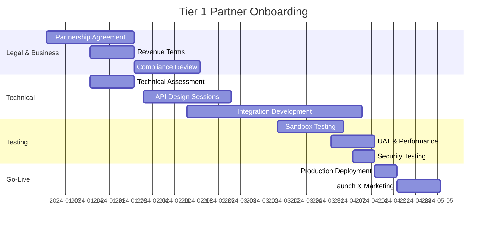

# LCopilot Integration Marketplace Strategy

## Executive Summary

LCopilot's Integration Marketplace transforms our platform into a **multi-sided ecosystem** connecting SMEs, banks, and service providers while protecting our dual billing revenue model. This strategy positions LCopilot as the **central hub for international trade technology**, creating network effects and sustainable competitive advantages.

### Key Value Propositions

1. **For SMEs**: One-stop platform for all trade-related integrations
2. **For Banks**: Standardized API access to validated trade documents
3. **For Service Providers**: Direct access to verified trade customers
4. **For LCopilot**: Multiple revenue streams with protected billing model

---

## Market Analysis

### Current Market Size

| Segment | Global Market Size | Growth Rate | LCopilot Addressable Market |
|---------|-------------------|-------------|----------------------------|
| **Trade Finance** | $52B (2024) | 7.2% CAGR | $2.6B (5% penetration) |
| **Customs Technology** | $8.5B (2024) | 12.1% CAGR | $850M (10% penetration) |
| **Logistics Software** | $17.4B (2024) | 15.3% CAGR | $1.7B (10% penetration) |
| **FX & Payments** | $28.9B (2024) | 8.9% CAGR | $1.4B (5% penetration) |
| **Total Addressable** | **$106.8B** | **10.9% CAGR** | **$6.55B** |

### Competitive Landscape

#### Direct Competitors
- **TradeShift**: Procurement focus, limited trade finance
- **GT Nexus**: Logistics focus, Oracle-owned
- **Bolero**: Document exchange, legacy technology

#### Indirect Competitors
- **SWIFT**: Messaging only, no integration platform
- **Individual APIs**: Fragmented, no unified billing
- **In-house Solutions**: High development costs, limited scale

### LCopilot's Competitive Advantages

1. **Dual Billing Model**: Unique revenue protection mechanism
2. **Document Validation Core**: Built-in trade document expertise
3. **Regulatory Compliance**: Pre-built compliance for multiple jurisdictions
4. **SME Focus**: Designed for emerging market exporters/importers
5. **Unified Platform**: Single API for multiple service types

---

## Partnership Tiers & Revenue Models

### Tier 1: Strategic Partners (Revenue Share)

**Target Partners**: Major banks, government agencies, enterprise logistics providers

**Characteristics**:
- Exclusive integration categories
- Co-development of features
- Joint go-to-market strategies
- Dedicated support resources

**Revenue Model**:
```
Revenue Share: 70% LCopilot / 30% Partner
Minimum Annual Commitment: $500K
Integration Development: Shared costs
Support Level: White-glove with dedicated team
```

**Example Partners**:
- **HSBC Trade & Receivables Finance**
- **Bangladesh Bank (Central Bank)**
- **Maersk Logistics**
- **VISA Cross-Border Solutions**

### Tier 2: Premium Partners (Fixed Revenue Share)

**Target Partners**: Regional banks, specialized service providers, fintech companies

**Characteristics**:
- Standard integration framework
- Co-marketing opportunities
- Priority support queue
- Beta access to new features

**Revenue Model**:
```
Revenue Share: 80% LCopilot / 20% Partner
Annual Commitment: $100K - $500K
Integration Development: LCopilot leads
Support Level: Priority with assigned CSM
```

**Example Partners**:
- **Standard Chartered Bangladesh**
- **Aramex Logistics**
- **Remitly International Payments**
- **TradeLens (IBM/Maersk)**

### Tier 3: Standard Partners (Transaction Fees)

**Target Partners**: Regional service providers, specialized software vendors

**Characteristics**:
- Self-service integration
- Standard documentation
- Community support
- Monthly business reviews

**Revenue Model**:
```
Transaction Fee: $0.50 - $2.00 per API call
No Annual Commitment
Integration Development: Self-service
Support Level: Community + email
```

**Example Partners**:
- **Regional customs brokers**
- **Local logistics companies**
- **Currency exchange providers**
- **Trade insurance providers**

### Tier 4: Community Partners (Free/Freemium)

**Target Partners**: Startups, open-source projects, academic institutions

**Characteristics**:
- Free sandbox access
- Community documentation
- Startup-friendly terms
- Growth pathway to paid tiers

**Revenue Model**:
```
Free Tier: 1,000 API calls/month
Paid Tier: $0.10 per additional call
No Minimum Commitment
Support Level: Community forum only
```

---

## Partner Acquisition Strategy

### Phase 1: Foundation Building (Months 1-6)

**Objective**: Establish credibility with 3-5 Tier 1 strategic partners

**Key Actions**:
1. **Direct Outreach to Strategic Partners**
   - HSBC, Standard Chartered, BRAC Bank for banking
   - Bangladesh Bank for regulatory endorsement
   - Maersk, DHL for logistics
   - Target: 1 partner per category

2. **Proof of Concept Development**
   - Build 2-3 complete integrations
   - Demonstrate dual billing model
   - Show compliance and security features
   - Measure performance metrics

3. **Regulatory Engagement**
   - Bangladesh Bank partnership for customs integration
   - Export Promotion Bureau collaboration
   - Trade body endorsements (BGMEA, BKMEA)

**Success Metrics**:
- 3 Tier 1 partners signed
- $1M+ in partnership commitments
- 50+ SMEs actively using integrations
- 99.5%+ platform uptime

### Phase 2: Market Expansion (Months 7-18)

**Objective**: Scale to 15-20 partners across all tiers

**Key Actions**:
1. **Geographic Expansion**
   - India: ICICI Bank, HDFC Bank
   - UAE: Emirates NBD, ADCB
   - Singapore: DBS, UOB
   - Target: 2-3 partners per market

2. **Vertical Expansion**
   - Insurance: Tokio Marine, AIG
   - FX: Western Union, Wise
   - Fintech: Trade finance platforms
   - Target: 3-5 new categories

3. **Channel Partner Program**
   - System integrators
   - Trade consultants
   - Technology vendors
   - Revenue share: 10-15%

**Success Metrics**:
- 20+ total partners
- $5M+ in annual recurring revenue
- 500+ active SME companies
- 95%+ partner satisfaction

### Phase 3: Platform Dominance (Months 19-36)

**Objective**: Become the dominant trade integration platform

**Key Actions**:
1. **Platform Features**
   - Partner marketplace portal
   - Self-service onboarding
   - Advanced analytics dashboard
   - White-label solutions

2. **Global Expansion**
   - North America: JPMorgan, Citi
   - Europe: Deutsche Bank, BNP Paribas
   - Asia-Pacific: ANZ, Standard Bank
   - Target: 50+ global partners

3. **Ecosystem Development**
   - Developer conferences
   - Integration certifications
   - Partner advisory board
   - Innovation labs

**Success Metrics**:
- 100+ partners across all tiers
- $25M+ annual recurring revenue
- 2,500+ active companies
- Market leadership position

---

## Partner Onboarding & Support Framework

### Onboarding Process by Tier

#### Tier 1 Strategic Partners (12-16 weeks)


#### Tier 2 Premium Partners (8-10 weeks)
- Streamlined legal process (2 weeks)
- Standard integration framework (4 weeks)
- Accelerated testing (2 weeks)
- Faster go-live (2 weeks)

#### Tier 3 Standard Partners (4-6 weeks)
- Template agreements (1 week)
- Self-service integration (2 weeks)
- Automated testing (1 week)
- Self-service go-live (1 week)

#### Tier 4 Community Partners (1-2 weeks)
- Online signup
- Instant sandbox access
- Self-service documentation
- Community support

### Support Framework

#### White-Glove Support (Tier 1)
- **Dedicated Partner Success Manager**
- **24/7 technical support hotline**
- **Quarterly business reviews**
- **Custom feature development**
- **Joint marketing campaigns**
- **Executive relationship management**

#### Premium Support (Tier 2)
- **Assigned Customer Success Manager**
- **Business hours technical support**
- **Monthly check-ins**
- **Priority feature requests**
- **Co-marketing opportunities**
- **Technical advisory sessions**

#### Standard Support (Tier 3)
- **Email and ticket support**
- **Community forum access**
- **Standard documentation**
- **Regular webinars**
- **Self-service resources**
- **Business hour response**

#### Community Support (Tier 4)
- **Community forum only**
- **Open-source documentation**
- **Developer tutorials**
- **Self-service onboarding**
- **Best-effort support**

---

## Revenue Optimization & Billing Models

### Dual Billing Protection in Marketplace

Our marketplace must maintain the **critical dual billing model** that protects LCopilot's core revenue:

#### SME Customer Billing (Primary Revenue)
```
Base Validation: $5 - $12 per document
├── Standard Tier: $5 per validation
├── Premium Tier: $8 per validation
└── Enterprise Tier: $12 per validation

Integration Usage: $1 - $20 per API call
├── Customs Submission: $10 - $15
├── Logistics Quote: $3 - $8
├── FX Quote: $2 - $5
└── Insurance Quote: $5 - $12
```

#### Bank Customer Billing (Secondary Revenue)
```
LC Recheck: $15 - $40 per validation
├── Standard Tier: $15 per recheck
├── Premium Tier: $25 per recheck
└── Enterprise Tier: $40 per recheck

CRITICAL: Banks cannot reuse SME validations
Billing Guard enforces 402 Payment Required
```

#### Partner Revenue Share Models

**Model 1: Fixed Percentage (Recommended)**
```
Partner receives % of integration fees only
SME validation fees: 100% retained by LCopilot
Bank recheck fees: 100% retained by LCopilot
Integration fees: Split with partner

Example:
├── SME pays $10 customs submission → $8 LCopilot, $2 Partner
├── Bank pays $25 LC recheck → $25 LCopilot, $0 Partner
└── Total: $33 LCopilot, $2 Partner (94% vs 6%)
```

**Model 2: Tiered Revenue Share**
```
Volume-based scaling:
├── 0-1,000 calls/month: 90% LCopilot / 10% Partner
├── 1,001-5,000 calls/month: 85% LCopilot / 15% Partner
├── 5,001-10,000 calls/month: 80% LCopilot / 20% Partner
└── 10,000+ calls/month: 75% LCopilot / 25% Partner
```

**Model 3: Value-Added Services**
```
Base integration: Standard revenue share
Premium features: Higher partner percentage
├── Real-time tracking: +5% partner share
├── Advanced analytics: +3% partner share
├── White-label options: +10% partner share
└── Custom development: Negotiated rates
```

### Partner Billing Implementation

#### Technical Implementation
```python
class PartnerBillingCalculator:
    def calculate_partner_share(self, event: IntegrationBillingEvent) -> Decimal:
        # CRITICAL: Never share SME validation or bank recheck fees
        if event.event_type in [BillingEventType.SME_VALIDATION, BillingEventType.BANK_RECHECK]:
            return Decimal('0.00')

        # Only share integration-specific fees
        partner_config = self.get_partner_config(event.integration_id)
        base_share = event.charged_amount * partner_config.revenue_share_percentage

        # Apply volume bonuses
        volume_bonus = self.calculate_volume_bonus(event.company_id, event.integration_id)

        return base_share + volume_bonus
```

#### Revenue Protection Mechanisms
1. **Immutable Billing Events**: Partner shares calculated from permanent records
2. **Monthly Reconciliation**: Automated partner payout calculations
3. **Audit Trail**: Complete revenue sharing audit log
4. **Dispute Resolution**: Clear escalation process for billing disputes

---

## Partner Marketplace Portal

### Self-Service Partner Portal Features

#### Dashboard & Analytics
```
Partner Performance Metrics:
├── API Call Volume (real-time)
├── Revenue Share Earned
├── Customer Acquisition
├── Integration Health Status
├── Support Ticket Metrics
└── SLA Performance
```

#### Integration Management
```
Self-Service Tools:
├── API Key Management
├── Webhook Configuration
├── Rate Limit Settings
├── Error Log Analysis
├── Performance Monitoring
└── Documentation Updates
```

#### Business Intelligence
```
Revenue Analytics:
├── Monthly/Quarterly Revenue Reports
├── Customer Segmentation Analysis
├── Usage Pattern Insights
├── Forecasting & Projections
├── Competitive Benchmarking
└── Market Opportunity Analysis
```

### Partner Certification Program

#### Technical Certification Levels
```
Bronze Certification:
├── Basic API integration
├── Standard authentication
├── Error handling compliance
├── Documentation completeness
└── Security baseline

Silver Certification:
├── Advanced API features
├── Webhook implementation
├── Performance optimization
├── Customer success metrics
└── Support responsiveness

Gold Certification:
├── Platform excellence
├── Innovation contributions
├── Market leadership
├── Customer satisfaction
└── Strategic partnership value
```

#### Certification Benefits
- **Higher revenue share percentages**
- **Priority in partner directory**
- **Marketing co-investment**
- **Early access to new features**
- **Dedicated success management**

---

## Go-to-Market Strategy

### Channel Strategy

#### Direct Sales (Tier 1 & 2 Partners)
```
Enterprise Sales Team:
├── VP of Partnerships
├── Strategic Account Managers (3)
├── Technical Solution Architects (2)
├── Partner Success Managers (3)
└── Legal & Compliance (2)

Target: $10M+ annual revenue partners
Approach: Consultative selling with custom solutions
Timeline: 6-18 month sales cycles
```

#### Channel Partners (Tier 3 Partners)
```
Channel Partner Types:
├── System Integrators (Accenture, Deloitte)
├── Trade Consultants (Regional specialists)
├── Technology Vendors (ERP, TMS providers)
└── Industry Associations (Trade bodies)

Commission: 10-15% of first-year revenue
Support: Partner enablement program
```

#### Self-Service (Tier 4 Partners)
```
Digital Marketing:
├── Content marketing (API documentation)
├── Developer conferences & hackathons
├── Online community building
├── Freemium conversion funnel
└── Partner referral programs
```

### Marketing & Positioning

#### Value Proposition by Audience

**For Banks:**
> "Standardized API access to pre-validated trade documents with guaranteed compliance and audit trails"

**For Logistics Providers:**
> "Direct access to verified exporters/importers with integrated document workflows and real-time tracking"

**For Government Agencies:**
> "Streamlined digital trade processes with built-in compliance and automated reporting"

**For Fintech Companies:**
> "Plug-and-play trade finance integrations with established customer base and proven technology"

#### Marketing Channels

1. **Industry Events & Conferences**
   - SIBOS (Banking)
   - Transport Logistic (Logistics)
   - Trade Finance Week
   - Regional trade shows

2. **Digital Marketing**
   - Developer-focused content
   - API documentation SEO
   - Partner success stories
   - Webinar series

3. **Thought Leadership**
   - Industry reports
   - Regulatory guidance
   - Technology trends
   - Best practices

4. **Strategic PR**
   - Partnership announcements
   - Customer success stories
   - Industry awards
   - Executive speaking

### Competitive Positioning

#### Differentiation Strategy

| Factor | LCopilot | TradeShift | GT Nexus | SWIFT |
|--------|----------|------------|----------|-------|
| **Core Focus** | Trade document validation | Procurement | Logistics | Messaging |
| **SME Focus** | ✅ Emerging markets | ❌ Enterprise only | ❌ Enterprise only | ❌ Banks only |
| **Dual Billing** | ✅ Protected model | ❌ Single billing | ❌ Single billing | ❌ No billing model |
| **Integration Depth** | ✅ Deep trade knowledge | ❌ Surface level | ❌ Logistics only | ❌ Messages only |
| **Compliance Built-in** | ✅ Multi-jurisdiction | ❌ Limited | ❌ Limited | ❌ Standards only |
| **Developer Experience** | ✅ Modern APIs | ❌ Legacy systems | ❌ Complex | ❌ Complex |

---

## Success Metrics & KPIs

### Partner Ecosystem Health

#### Growth Metrics
```
Partner Acquisition:
├── New partners per quarter
├── Partner tier distribution
├── Time to first revenue
├── Partner retention rate
└── Revenue per partner

Market Penetration:
├── Market share by vertical
├── Geographic coverage
├── Customer overlap analysis
├── Competitive win rate
└── Brand recognition
```

#### Financial Metrics
```
Revenue Performance:
├── Total marketplace revenue
├── Revenue growth rate (QoQ/YoY)
├── Partner revenue share
├── Customer lifetime value
└── Revenue per API call

Profitability:
├── Gross margin by partner tier
├── Customer acquisition cost
├── Partner onboarding cost
├── Support cost per partner
└── ROI on partnership investments
```

#### Operational Metrics
```
Platform Performance:
├── API response times
├── System uptime (99.9% target)
├── Error rates by integration
├── Partner satisfaction scores
└── Support ticket resolution time

Customer Success:
├── Active monthly users
├── API calls per customer
├── Customer churn rate
├── Net Promoter Score
└── Feature adoption rates
```

### Quarterly Review Framework

#### Q1 2024 Targets
- **3 Tier 1 partners** signed and onboarded
- **$500K** in partnership commitments
- **50 SME customers** actively using integrations
- **99.5% platform uptime**

#### Q2 2024 Targets
- **8 total partners** across all tiers
- **$1.5M** annual recurring revenue
- **150 SME customers** active
- **2 new geographic markets**

#### Q3 2024 Targets
- **15 total partners** with global presence
- **$3M** annual recurring revenue
- **300 SME customers** active
- **5 integration categories** live

#### Q4 2024 Targets
- **25 total partners** including 5 Tier 1
- **$5M** annual recurring revenue
- **500 SME customers** active
- **Market leadership** in Bangladesh

---

## Risk Management & Mitigation

### Strategic Risks

#### Partner Dependency Risk
**Risk**: Over-reliance on single strategic partner
**Mitigation**:
- Diversify partner portfolio across tiers
- Maintain direct customer relationships
- Build proprietary integration capabilities
- Negotiate non-exclusive agreements

#### Competitive Response Risk
**Risk**: Incumbents build competing platforms
**Mitigation**:
- Accelerate partnership acquisition
- Build switching costs through deep integrations
- Invest in continuous innovation
- Strengthen regulatory relationships

#### Technology Obsolescence Risk
**Risk**: New technologies disrupt integration model
**Mitigation**:
- Invest in R&D and emerging technologies
- Partner with technology innovators
- Maintain flexible architecture
- Monitor industry trends actively

### Operational Risks

#### Partner Performance Risk
**Risk**: Partner API downtime affects customers
**Mitigation**:
- Multi-partner redundancy per category
- SLA enforcement with penalties
- Real-time monitoring and alerting
- Automated failover capabilities

#### Compliance Risk
**Risk**: Regulatory changes affect integrations
**Mitigation**:
- Proactive regulatory monitoring
- Legal review of all partnerships
- Compliance automation where possible
- Strong relationships with regulators

#### Security Risk
**Risk**: Partner security breach affects platform
**Mitigation**:
- Comprehensive security assessments
- Zero-trust architecture implementation
- Regular penetration testing
- Incident response procedures

### Financial Risks

#### Revenue Concentration Risk
**Risk**: Over-dependence on few large partners
**Mitigation**:
- Balanced portfolio across all tiers
- Direct customer revenue protection
- Diversified revenue streams
- Contract terms limiting dependency

#### Billing Model Risk
**Risk**: Pressure to change dual billing model
**Mitigation**:
- Strong contractual protections
- Clear value differentiation
- Alternative revenue streams
- Market education on value

---

## Conclusion & Next Steps

### Strategic Recommendations

1. **Immediate Actions (Next 30 Days)**
   - Finalize Tier 1 partner target list
   - Develop partnership term sheets
   - Create partner onboarding playbook
   - Launch partner portal development

2. **Short-term Goals (Next 90 Days)**
   - Sign first Tier 1 strategic partner
   - Complete 2-3 integration POCs
   - Establish partner success team
   - Launch developer documentation

3. **Medium-term Objectives (Next 12 Months)**
   - Achieve 20+ active partners
   - Reach $5M annual recurring revenue
   - Establish market leadership in Bangladesh
   - Expand to 3 additional markets

### Investment Requirements

```
Year 1 Investment Needs:
├── Partnership Team: $800K (4 FTEs)
├── Technology Development: $1.2M (6 FTEs)
├── Marketing & Events: $300K
├── Legal & Compliance: $200K
└── Total: $2.5M

Expected ROI:
├── Year 1 Revenue: $5M
├── Year 2 Revenue: $15M
├── Year 3 Revenue: $35M
└── 3-Year ROI: 1,300%
```

### Success Factors

The LCopilot Integration Marketplace will succeed by:

1. **Protecting Core Revenue Model**: Maintaining dual billing protection while enabling partner revenue sharing
2. **Delivering Superior Experience**: Best-in-class developer experience and partner support
3. **Building Network Effects**: Creating value that increases with each new partner and customer
4. **Maintaining Quality**: Rigorous partner vetting and continuous performance monitoring
5. **Scaling Intelligently**: Balanced growth across partner tiers and geographic markets

This marketplace strategy positions LCopilot as the **central nervous system of international trade**, connecting all stakeholders while protecting our unique dual billing business model and creating sustainable competitive advantages through network effects.

---

*The marketplace strategy serves as our roadmap to building the dominant trade integration platform while maintaining revenue protection and creating value for all ecosystem participants.*