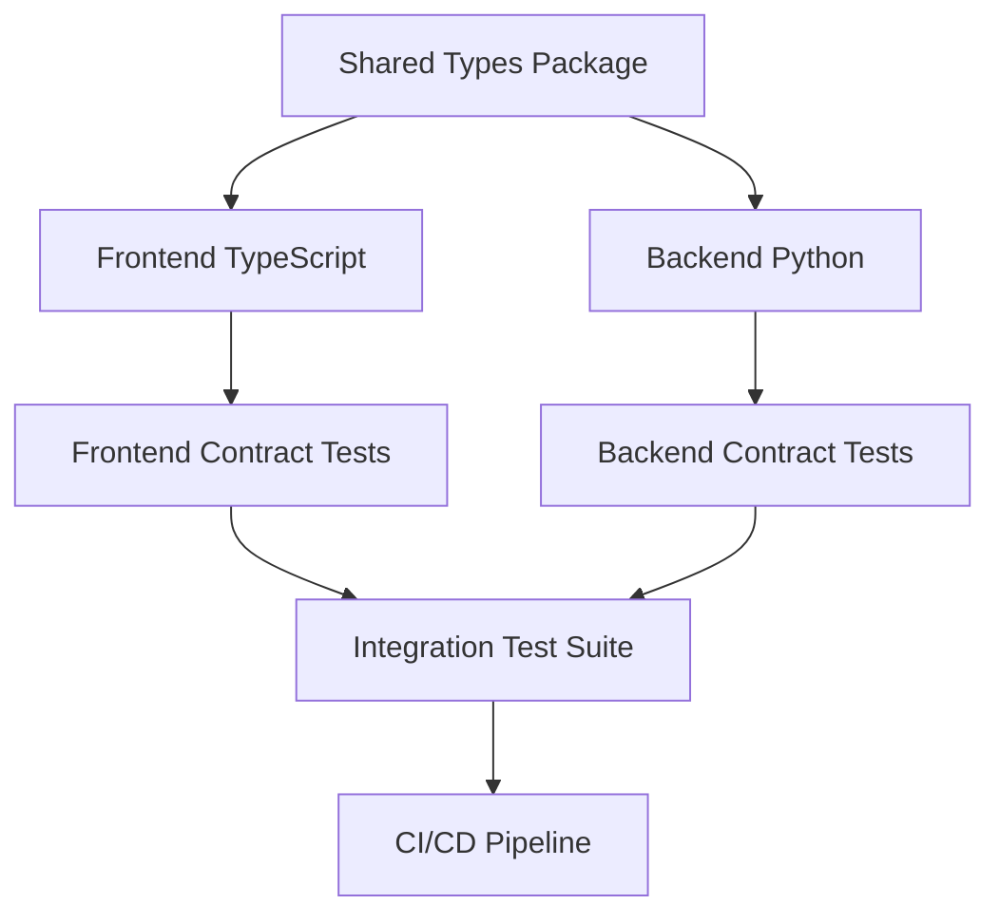

# Integration Testing Strategy

This document outlines the comprehensive integration testing strategy designed to address the TEST-001 issue identified in the QA review, focusing on API contract testing using the shared-types package.

## Overview

The integration testing strategy ensures that frontend and backend components maintain API contract compatibility through automated testing. The shared-types package serves as the single source of truth for all API contracts.

## Architecture

### Shared-Types Package

The `packages/shared-types` package provides:

1. **TypeScript Definitions** - Type-safe interfaces for frontend
2. **Zod Schemas** - Runtime validation for TypeScript
3. **Python Pydantic Models** - Backend validation schemas
4. **Validation Utilities** - Helper functions for contract testing

### Contract Testing Flow



## Test Categories

### 1. API Contract Tests

**Purpose:** Validate that API endpoints accept and return data matching shared-types schemas.

**Frontend Tests (`apps/web/tests/integration/api-contract.test.ts`):**
- Validate API responses match TypeScript interfaces
- Test request/response schema compliance
- Verify error response formats
- Test type safety at compile and runtime

**Backend Tests (`apps/api/tests/integration/test_api_contracts.py`):**
- Validate FastAPI endpoints match Pydantic schemas
- Test request validation and response serialization
- Verify error handling consistency
- Test schema evolution compatibility

### 2. Schema Synchronization Tests

**Purpose:** Ensure TypeScript and Python schemas remain synchronized.

**Test Coverage:**
- Enum values consistency between languages
- Required vs optional field alignment
- Field type compatibility
- Default value consistency

### 3. Cross-Service Integration Tests

**Purpose:** Test complete workflows across frontend and backend.

**Test Scenarios:**
- File upload flow (frontend → backend → AWS S3)
- OCR processing workflow (upload → queue → process → results)
- Authentication flow (login → token → protected resources)
- Error propagation across service boundaries

## Implementation Details

### Shared-Types Package Structure

```
packages/shared-types/
├── src/
│   ├── api.ts              # TypeScript types and Zod schemas
│   └── index.ts            # Main export file
├── python/
│   └── schemas.py          # Pydantic models
├── scripts/
│   └── generate-python-schemas.js  # Schema generation script
├── package.json
└── tsconfig.json
```

### Key Features

#### 1. Zod Schema Validation

```typescript
// Type-safe validation with detailed error messages
const result = HealthResponseSchema.safeParse(apiResponse);
if (!result.success) {
  console.error('Validation failed:', result.error.issues);
}
```

#### 2. Pydantic Model Validation

```python
# Automatic validation with FastAPI integration
@app.get("/health", response_model=HealthResponse)
async def health_check():
    return HealthResponse(
        status="healthy",
        timestamp=datetime.now(timezone.utc),
        version="1.0.0",
        services=HealthServices(database="connected")
    )
```

#### 3. Runtime Schema Registry

```python
# Dynamic schema access for testing
schema_class = get_schema("HealthResponse")
validated_data = validate_data("HealthResponse", raw_data)
```

## Test Execution Strategy

### Local Development

```bash
# Run frontend contract tests
cd apps/web
npm run test:integration

# Run backend contract tests
cd apps/api
pytest tests/integration/test_api_contracts.py -v

# Run full integration suite
npm run test:integration:all
```

### CI/CD Integration

The integration tests are integrated into the CI/CD pipeline:

1. **Parallel Execution** - Frontend and backend tests run simultaneously
2. **Schema Validation** - Automated checks for schema consistency
3. **Contract Drift Detection** - Fail builds when contracts diverge
4. **Performance Testing** - Monitor API response times

### Test Data Management

#### Test Database Setup

```yaml
# docker-compose.test.yml
services:
  postgres-test:
    image: postgres:15
    environment:
      POSTGRES_DB: test_db
      POSTGRES_USER: postgres
      POSTGRES_PASSWORD: postgres
```

#### Mock Data Generation

```typescript
// Test data factories using shared types
const createMockHealthResponse = (): HealthResponse => ({
  status: 'healthy',
  timestamp: new Date().toISOString(),
  version: '1.0.0',
  services: {
    database: 'connected',
    redis: 'connected'
  }
});
```

## Contract Evolution Strategy

### Backward Compatibility

1. **Additive Changes** - New optional fields can be added safely
2. **Deprecation Process** - Mark fields as deprecated before removal
3. **Version Negotiation** - API versioning for breaking changes
4. **Migration Testing** - Validate upgrade/downgrade scenarios

### Schema Validation Pipeline

```bash
# Pre-commit hooks
npm run type-check          # TypeScript compilation
npm run validate-schemas    # Cross-language schema consistency
npm run test:contracts      # Contract compliance tests
```

### Breaking Change Detection

```typescript
// Automated schema comparison
const detectBreakingChanges = (oldSchema: ZodSchema, newSchema: ZodSchema) => {
  // Compare required fields, types, and constraints
  // Flag potential breaking changes
};
```

## Performance Considerations

### Test Optimization

1. **Parallel Execution** - Run tests concurrently where possible
2. **Test Isolation** - Independent test data and cleanup
3. **Mock External Services** - Reduce external dependencies
4. **Selective Testing** - Run only affected tests on changes

### Monitoring and Metrics

```typescript
// Performance tracking in tests
const startTime = performance.now();
const response = await apiClient.get('/health');
const responseTime = performance.now() - startTime;

expect(responseTime).toBeLessThan(200); // 200ms SLA
```

## Error Handling and Debugging

### Contract Validation Errors

```typescript
// Detailed validation error reporting
try {
  validateSchema(schemas.HealthResponse, response.data);
} catch (error) {
  console.error('Contract validation failed:', {
    endpoint: '/health',
    expected: 'HealthResponse',
    received: response.data,
    errors: error.message
  });
}
```

### Test Debugging Tools

1. **Schema Diff Visualization** - Show differences between expected and actual
2. **Request/Response Logging** - Capture full HTTP interactions
3. **Type Error Analysis** - Detailed TypeScript compilation errors
4. **Validation Error Tracing** - Map validation failures to source

## Security Considerations

### Test Data Security

1. **No Production Data** - Use synthetic test data only
2. **Credential Management** - Secure handling of test credentials
3. **Data Isolation** - Separate test and production environments
4. **Cleanup Procedures** - Remove test data after execution

### API Security Testing

```typescript
// Test authentication and authorization
describe('API Security', () => {
  test('should require authentication for protected endpoints', async () => {
    const response = await apiClient.get('/protected-resource');
    expect(response.status).toBe(401);
    expect(response.data).toMatchSchema(schemas.ApiError);
  });
});
```

## Maintenance and Updates

### Regular Maintenance Tasks

1. **Weekly Schema Reviews** - Check for drift between languages
2. **Monthly Performance Analysis** - Monitor test execution times
3. **Quarterly Security Audits** - Review test data and credentials
4. **Annual Strategy Review** - Update testing approaches

### Continuous Improvement

1. **Test Coverage Analysis** - Identify gaps in contract coverage
2. **Failure Pattern Analysis** - Learn from common test failures
3. **Developer Feedback** - Incorporate team suggestions
4. **Tool Evaluation** - Assess new testing tools and techniques

## Success Metrics

### Coverage Metrics

- **API Endpoint Coverage**: 100% of public APIs tested
- **Schema Coverage**: All shared-types schemas validated
- **Error Scenario Coverage**: All error responses tested
- **Cross-Service Flow Coverage**: All critical workflows tested

### Quality Metrics

- **Test Reliability**: < 1% flaky test rate
- **Execution Time**: < 5 minutes for full suite
- **Contract Drift Detection**: 100% breaking changes caught
- **Developer Productivity**: Reduced integration debugging time

### Compliance Metrics

- **Type Safety**: Zero runtime type errors in production
- **API Consistency**: 100% frontend/backend schema alignment
- **Documentation Currency**: All contracts documented and current
- **Change Management**: All schema changes tracked and approved

This comprehensive integration testing strategy ensures robust API contract compliance while maintaining development velocity and system reliability.
