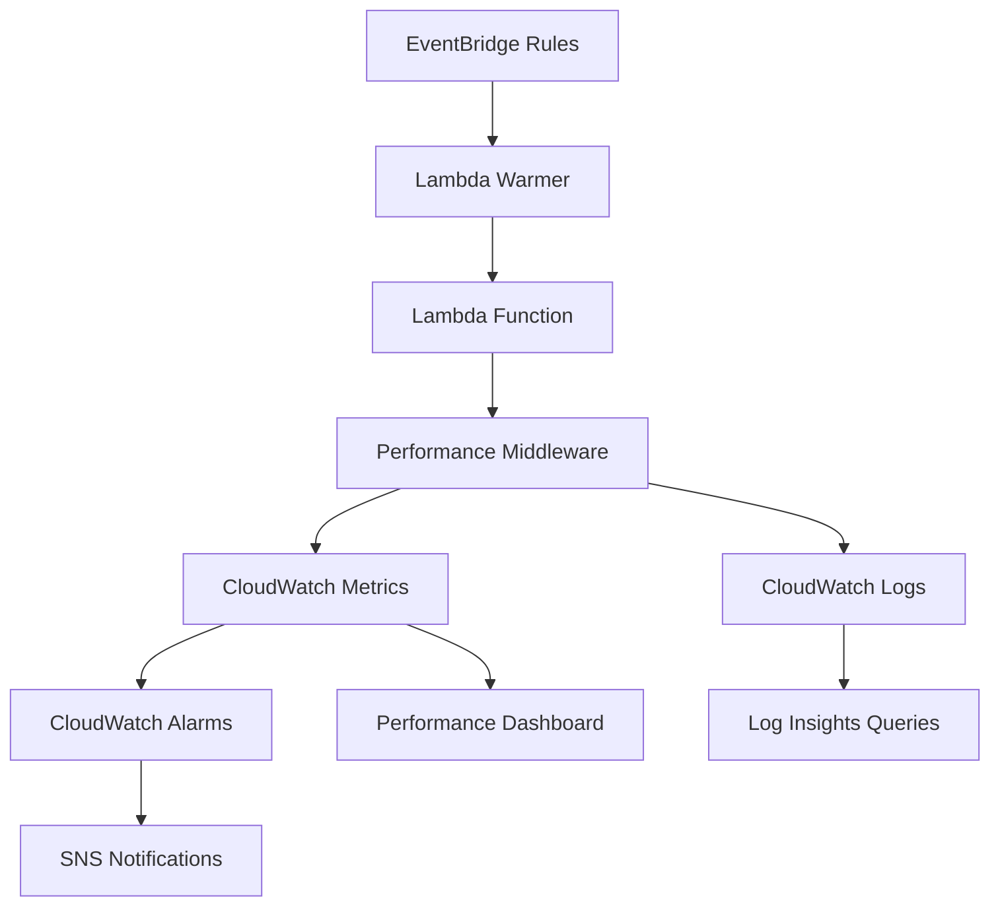

# Lambda Performance Monitoring Strategy

This document outlines the comprehensive performance monitoring strategy designed to address the PERF-001 issue identified in the QA review, focusing on Lambda cold start monitoring, mitigation, and overall performance optimization.

## Overview

The performance monitoring strategy provides multi-layered monitoring and optimization for AWS Lambda functions, including:

1. **Cold Start Detection & Monitoring** - Real-time tracking of Lambda cold starts
2. **Performance Metrics Collection** - Comprehensive metrics gathering via CloudWatch
3. **Proactive Warming** - Intelligent Lambda warming to prevent cold starts
4. **Performance Optimization** - Code-level optimizations and best practices
5. **Alerting & Dashboards** - Real-time monitoring and alerting system

## Architecture

### Monitoring Components



### Key Components

1. **Performance Monitoring Middleware** (`apps/api/middleware/performance_monitoring.py`)
2. **CloudWatch Monitoring Stack** (`infrastructure/monitoring/lambda-monitoring-stack.ts`)
3. **Lambda Warmer System** (`infrastructure/monitoring/lambda-warmer-stack.ts`)
4. **Performance-Optimized FastAPI App** (`apps/api/main.py`)

## Cold Start Monitoring

### Detection Mechanism

The performance monitoring middleware automatically detects cold starts using a module-level flag:

```python
class PerformanceMonitor:
    def __init__(self):
        self.is_cold_start = True  # First invocation is always cold start
        
    def __call__(self, handler):
        def wrapper(event, context):
            cold_start = self.is_cold_start
            self.is_cold_start = False  # Subsequent calls are warm
            # ... monitoring logic
```

### Cold Start Metrics

**Custom CloudWatch Metrics:**
- `AWS/Lambda/Performance/ColdStarts` - Count of cold start occurrences
- `AWS/Lambda/InitDuration` - AWS built-in initialization duration
- `AWS/Lambda/Performance/MemoryUtilization` - Memory usage percentage
- `AWS/Lambda/Performance/ExecutionTime` - Custom execution time tracking

### Cold Start Analysis

**CloudWatch Log Insights Queries:**

1. **Cold Start Frequency Analysis:**
```sql
fields @timestamp, @requestId, @duration, @initDuration
| filter @type = "REPORT"
| filter ispresent(@initDuration)
| stats count() as coldStarts, avg(@initDuration) as avgInitDuration
| sort @timestamp desc
```

2. **Performance Impact Analysis:**
```sql
fields @timestamp, @requestId, @duration, @maxMemoryUsed
| filter @type = "REPORT"
| filter @duration > 2000
| sort @duration desc
| limit 100
```

## Performance Metrics Collection

### Comprehensive Metrics

**AWS Lambda Built-in Metrics:**
- Duration (execution time)
- Errors (error count)
- Invocations (total invocations)
- Throttles (throttling events)
- ConcurrentExecutions (concurrent executions)
- InitDuration (cold start initialization time)

**Custom Performance Metrics:**
- Cold start count and frequency
- Memory utilization percentage
- Execution time percentiles (P50, P90, P99)
- Success/error rates with custom categorization
- Operation-specific performance tracking

### Metrics Publishing

```python
def _publish_metrics(self, metrics: Dict[str, Any]) -> None:
    """Publish custom metrics to CloudWatch."""
    metric_data = []
    
    # Cold start metric
    if metrics.get('cold_start', False):
        metric_data.append({
            'MetricName': 'ColdStarts',
            'Value': 1,
            'Unit': 'Count',
            'Dimensions': [{'Name': 'FunctionName', 'Value': self.function_name}]
        })
    
    # Memory utilization metric
    metric_data.append({
        'MetricName': 'MemoryUtilization',
        'Value': metrics['memory_utilization'],
        'Unit': 'Percent',
        'Dimensions': [{'Name': 'FunctionName', 'Value': self.function_name}]
    })
    
    # Publish to CloudWatch
    self.cloudwatch.put_metric_data(
        Namespace='AWS/Lambda/Performance',
        MetricData=metric_data
    )
```

## Lambda Warming Strategy

### Intelligent Warming System

The Lambda warmer provides multiple warming strategies:

1. **Scheduled Warming** - Regular warming every 5 minutes
2. **Peak Hours Warming** - More frequent warming during business hours
3. **Pre-deployment Warming** - Intensive warming before deployments
4. **Conditional Warming** - Context-aware warming based on usage patterns

### Warming Implementation

```python
def warm_function(function_name: str, concurrent_requests: int) -> Dict[str, Any]:
    """Warm the target function with concurrent requests."""
    
    warming_payload = {
        'source': 'lambda-warmer',
        'warming': True,
        'timestamp': datetime.now(timezone.utc).isoformat()
    }
    
    # Use ThreadPoolExecutor for concurrent invocations
    with ThreadPoolExecutor(max_workers=concurrent_requests) as executor:
        futures = [
            executor.submit(invoke_function, function_name, warming_payload, i)
            for i in range(concurrent_requests)
        ]
        
        # Collect results
        successful_invocations = sum(
            1 for future in futures 
            if future.result(timeout=25).get('success', False)
        )
    
    return {
        'successful_invocations': successful_invocations,
        'total_requests': concurrent_requests
    }
```

### Warming Schedules

**Default Schedule:**
- Every 5 minutes during normal hours
- Every 2 minutes during peak hours (9 AM - 6 PM UTC)
- 3 concurrent warming requests

**Pre-deployment Schedule:**
- Every 30 seconds for 10 minutes
- 10 concurrent warming requests
- Manually triggered before deployments

## Performance Optimization

### Code-Level Optimizations

1. **Module Preloading:**
```python
def preload_modules():
    """Preload commonly used modules to reduce import time."""
    common_modules = [
        'json', 'datetime', 'uuid', 'hashlib', 'base64',
        'urllib.parse', 'boto3', 'fastapi', 'pydantic'
    ]
    
    for module in common_modules:
        importlib.import_module(module)
```

2. **Connection Warming:**
```python
def warm_up_connections():
    """Pre-warm database and external service connections."""
    # Pre-warm database connection
    db = get_db_connection()
    db.execute("SELECT 1").fetchone()
    
    # Pre-warm Redis connection
    redis_client = redis.Redis.from_url(os.environ.get('REDIS_URL'))
    redis_client.ping()
```

3. **Memory Optimization:**
```python
# Monitor memory usage throughout request lifecycle
def _get_memory_usage(self) -> float:
    """Get current memory usage in MB."""
    process = psutil.Process()
    memory_info = process.memory_info()
    return memory_info.rss / 1024 / 1024
```

### FastAPI Integration

The FastAPI application is optimized for Lambda performance:

```python
@app.middleware("http")
async def performance_middleware(request: Request, call_next):
    """Add performance monitoring to all requests."""
    start_time = time.time()
    response = await call_next(request)
    process_time = time.time() - start_time
    response.headers["X-Process-Time"] = str(process_time)
    return response

# Warming endpoint for Lambda warmer
@app.post("/warm")
async def warm_endpoint(request: Request):
    """Handle warming requests from Lambda warmer."""
    body = await request.json()
    if body.get('warming') and body.get('source') == 'lambda-warmer':
        return {"status": "warm", "timestamp": time.time()}
    return {"status": "ok"}
```

## CloudWatch Dashboard

### Performance Dashboard Components

1. **Overview Metrics**
   - Invocations and Errors
   - Success Rate percentage
   - Average Duration

2. **Cold Start Analysis**
   - Cold Start count over time
   - Init Duration trends
   - Cold Start frequency analysis

3. **Resource Utilization**
   - Memory Utilization percentage
   - Duration Percentiles (P50, P90, P99)
   - Concurrent Executions

4. **Performance Trends**
   - Response time trends
   - Error rate analysis
   - Throttling events

### Dashboard Widgets

```typescript
// Cold start metrics widget
new cloudwatch.GraphWidget({
  title: 'Cold Starts',
  left: [coldStartMetric],
  width: 12,
  height: 6,
})

// Duration percentiles widget
new cloudwatch.GraphWidget({
  title: 'Duration Percentiles',
  left: [
    lambdaFunction.metricDuration({ statistic: 'p50' }),
    lambdaFunction.metricDuration({ statistic: 'p90' }),
    lambdaFunction.metricDuration({ statistic: 'p99' }),
  ],
  width: 12,
  height: 6,
})
```

## Alerting Strategy

### Performance Alarms

1. **High Cold Start Rate**
   - Threshold: >10 cold starts in 5 minutes
   - Action: SNS notification to development team

2. **High Init Duration**
   - Threshold: >2 seconds initialization time
   - Action: SNS notification with investigation guidance

3. **High Memory Utilization**
   - Threshold: >85% memory usage
   - Action: SNS notification for memory optimization

4. **High Response Time**
   - Threshold: >5 seconds average duration
   - Action: SNS notification for performance investigation

5. **High Error Rate**
   - Threshold: >5 errors in 5 minutes
   - Action: Immediate SNS notification

### Alert Configuration

```typescript
new cloudwatch.Alarm(this, 'HighColdStartRate', {
  alarmName: `${functionName}-high-cold-start-rate`,
  metric: coldStartMetric,
  threshold: 10,
  evaluationPeriods: 2,
  comparisonOperator: cloudwatch.ComparisonOperator.GREATER_THAN_THRESHOLD,
}).addAlarmAction(new cdk.aws_cloudwatch_actions.SnsAction(alarmTopic));
```

## X-Ray Tracing Integration

### Distributed Tracing

X-Ray tracing provides detailed performance analysis:

```python
# Enable X-Ray tracing in Lambda function
lambdaFunction.addEnvironment('_X_AMZN_TRACE_ID', 'Root=1-00000000-000000000000000000000000');

# Add X-Ray permissions
lambdaFunction.addToRolePolicy(new iam.PolicyStatement({
  effect: iam.Effect.ALLOW,
  actions: ['xray:PutTraceSegments', 'xray:PutTelemetryRecords'],
  resources: ['*'],
}));
```

### Trace Analysis

X-Ray provides insights into:
- Service map visualization
- Latency analysis by service
- Error analysis and root cause identification
- Performance bottleneck identification

## Performance Testing

### Load Testing Strategy

1. **Cold Start Load Testing**
   - Simulate burst traffic after idle periods
   - Measure cold start frequency and impact
   - Validate warming effectiveness

2. **Sustained Load Testing**
   - Test performance under sustained load
   - Monitor memory usage and optimization
   - Validate auto-scaling behavior

3. **Stress Testing**
   - Test performance under extreme load
   - Identify breaking points
   - Validate error handling and recovery

### Performance Benchmarks

**Target Performance Metrics:**
- Cold Start Rate: <5% of total invocations
- Init Duration: <1 second average
- Response Time: <200ms for API calls (excluding cold starts)
- Memory Utilization: <80% average
- Error Rate: <0.1%

## Cost Optimization

### Monitoring Costs

The performance monitoring system is designed for cost efficiency:

1. **Metric Publishing Optimization**
   - Batch metric publishing (up to 20 metrics per request)
   - Conditional publishing based on thresholds
   - Efficient metric aggregation

2. **Warming Cost Management**
   - Intelligent warming schedules
   - Conditional warming based on usage patterns
   - Cost tracking via resource tagging

3. **Log Retention Optimization**
   - Appropriate log retention periods
   - Log filtering to reduce storage costs
   - Efficient log queries

### Cost Monitoring

```typescript
// Add cost tracking tags
cdk.Tags.of(this).add('Service', 'LambdaMonitoring');
cdk.Tags.of(this).add('CostCenter', 'Performance');
cdk.Tags.of(this).add('Environment', environment);
```

## Operational Procedures

### Performance Investigation Workflow

1. **Alert Received**
   - Check CloudWatch dashboard for context
   - Review recent deployment history
   - Analyze X-Ray traces for bottlenecks

2. **Cold Start Investigation**
   - Run Log Insights cold start analysis query
   - Check warming function logs
   - Verify warming schedule effectiveness

3. **Performance Degradation**
   - Compare current metrics with historical baselines
   - Check for code changes or configuration updates
   - Analyze memory usage patterns

4. **Resolution Actions**
   - Adjust Lambda memory allocation if needed
   - Optimize code for performance bottlenecks
   - Update warming schedules or frequency
   - Scale concurrent warming requests

### Maintenance Tasks

**Weekly:**
- Review performance dashboard for trends
- Analyze cold start patterns and optimization opportunities
- Check warming effectiveness and costs

**Monthly:**
- Performance benchmark comparison
- Cost analysis and optimization review
- Alert threshold tuning based on usage patterns

**Quarterly:**
- Performance testing and load testing
- Architecture review for optimization opportunities
- Monitoring strategy updates and improvements

## Success Metrics

### Performance KPIs

1. **Cold Start Metrics**
   - Cold start percentage: Target <5%
   - Average init duration: Target <1s
   - Cold start impact on response time

2. **Response Time Metrics**
   - P50 response time: Target <200ms
   - P90 response time: Target <500ms
   - P99 response time: Target <1s

3. **Reliability Metrics**
   - Error rate: Target <0.1%
   - Success rate: Target >99.9%
   - Availability: Target >99.95%

4. **Resource Efficiency**
   - Memory utilization: Target 60-80%
   - Cost per invocation optimization
   - Warming cost efficiency

### Monitoring Effectiveness

- **Alert Accuracy**: >95% of alerts should be actionable
- **Mean Time to Detection**: <5 minutes for performance issues
- **Mean Time to Resolution**: <30 minutes for performance issues
- **Dashboard Utilization**: Regular usage by development team

This comprehensive performance monitoring strategy ensures optimal Lambda performance while maintaining cost efficiency and providing detailed visibility into system behavior.
